# CoTravel - Arquitectura Técnica

> La forma más simple de organizar viajes grupales y gestionar presupuestos compartidos con escrow en blockchain.

---

## Visión General

CoTravel es una plataforma que permite a grupos de amigos coordinar viajes, recolectar contribuciones hacia un
presupuesto compartido y aplicar reglas justas mediante smart contracts en Stellar/Soroban.

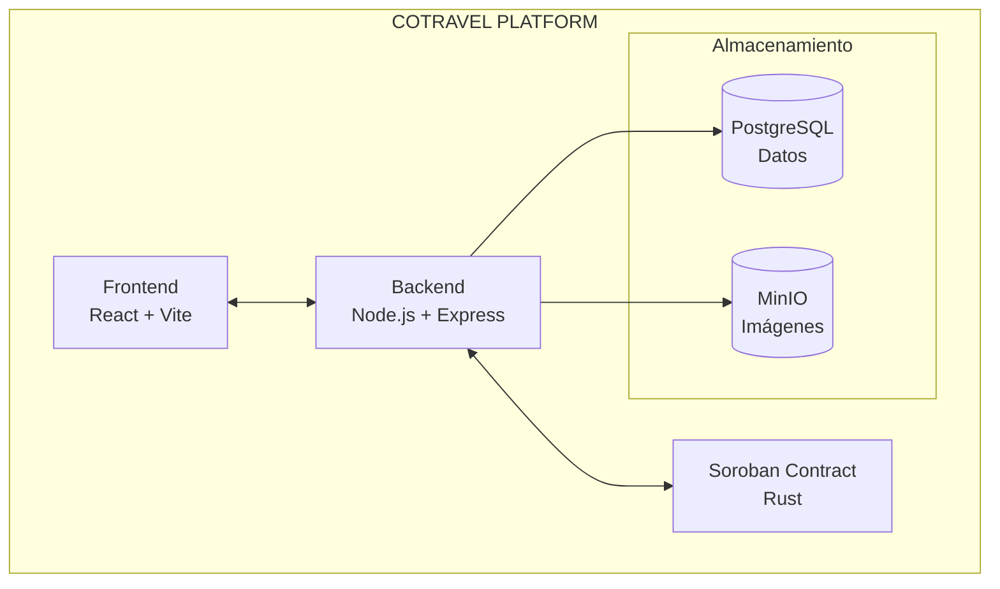

---

## Stack Tecnológico

| Componente     | Tecnología                 | Propósito                                             |
|----------------|----------------------------|-------------------------------------------------------|
| Frontend       | React + Vite + Stellar SDK | Interfaz de usuario, conexión con wallets             |
| Backend        | Node.js + Express          | API REST, lógica de negocio, integración con partners |
| Base de datos  | PostgreSQL                 | Usuarios, grupos, viajes, transacciones               |
| Almacenamiento | MinIO (S3 compatible)      | Imágenes de perfil, fotos de viajes                   |
| Smart Contract | Soroban (Rust)             | Escrow, milestones, reembolsos automáticos            |
| Blockchain     | Stellar Network            | Transacciones, wallets grupales                       |

---

## Estructura del Proyecto

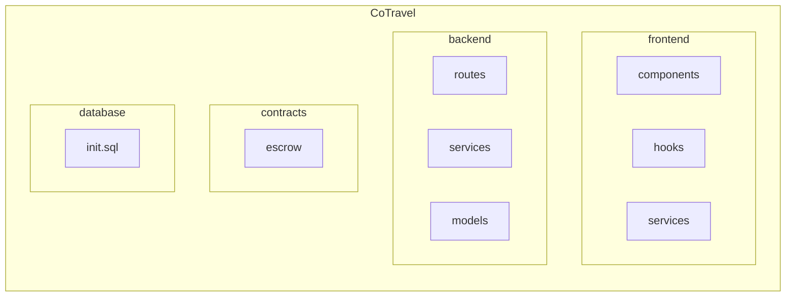

---

## Servicios Docker

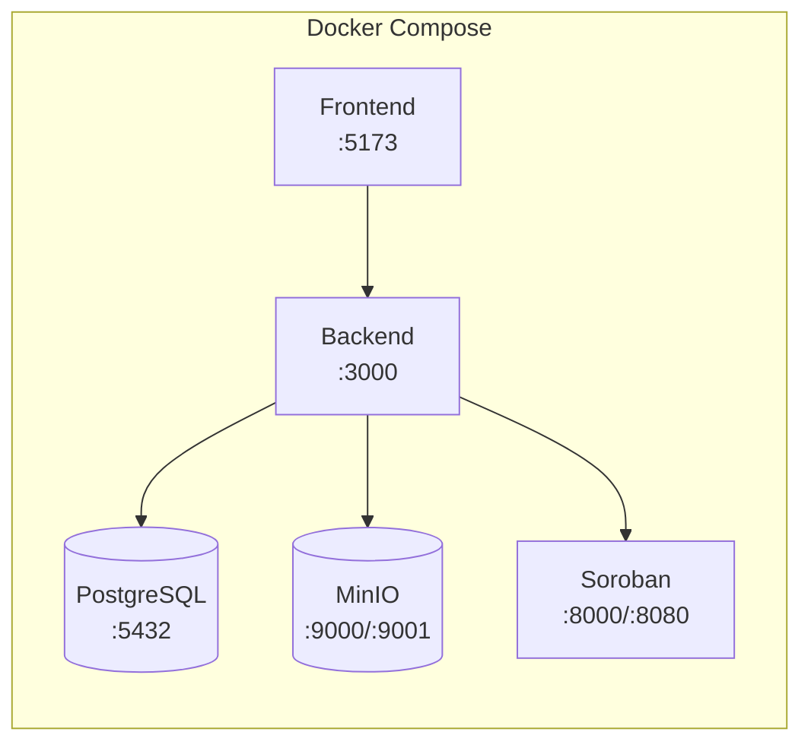

| Servicio   | Puerto      | Descripción               |
|------------|-------------|---------------------------|
| Frontend   | 5173        | Aplicación React          |
| Backend    | 3000        | API REST                  |
| PostgreSQL | 5432        | Base de datos relacional  |
| MinIO      | 9000 / 9001 | Almacenamiento de objetos |
| Soroban    | 8000 / 8080 | Red local Stellar + RPC   |

---

## Flujos Principales

### 1. Creación de Viaje Grupal

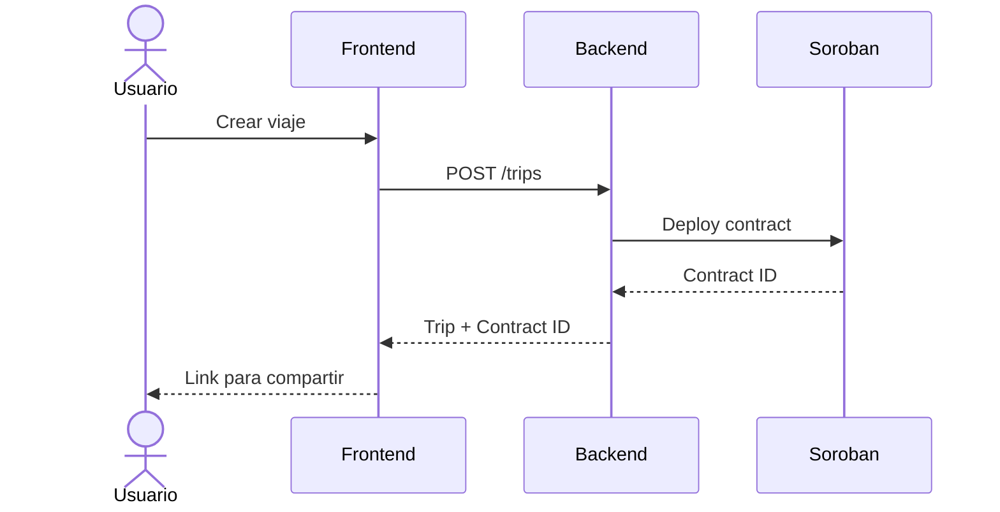

### 2. Contribución al Presupuesto

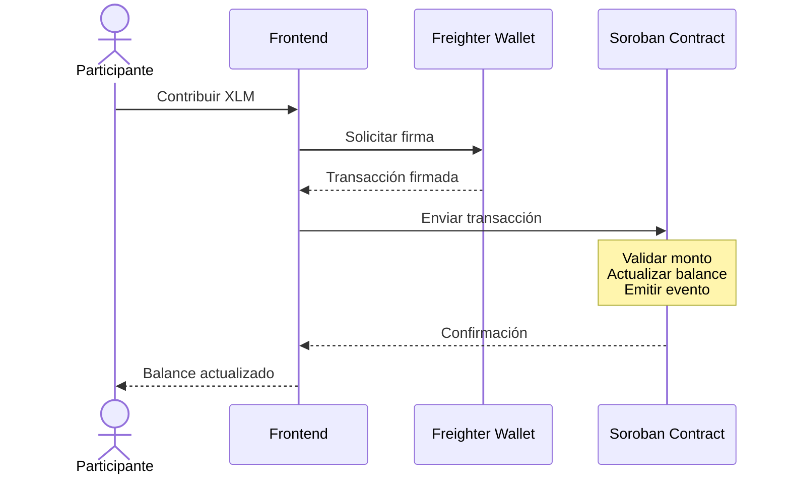

### 3. Abandono y Reembolso

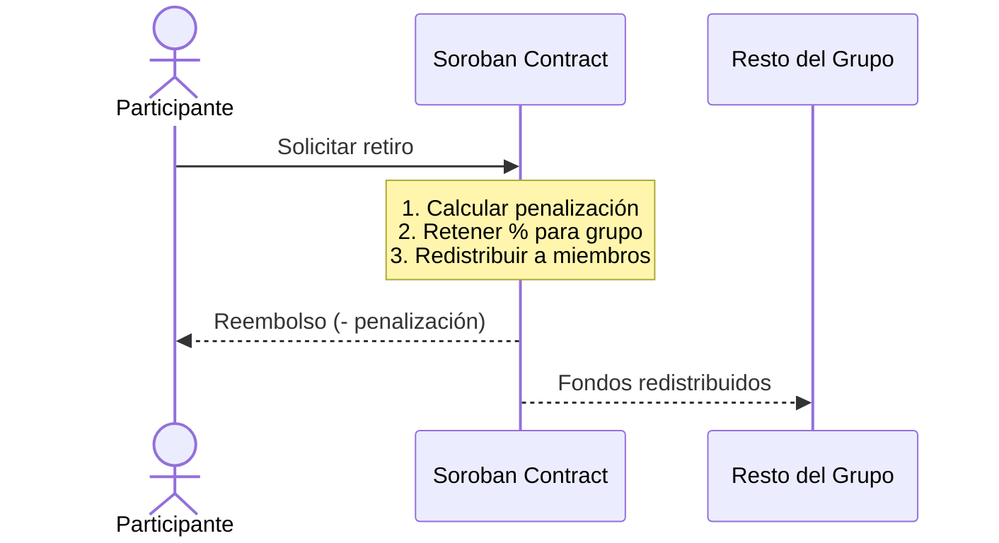

---

## Ciclo de Vida del Viaje

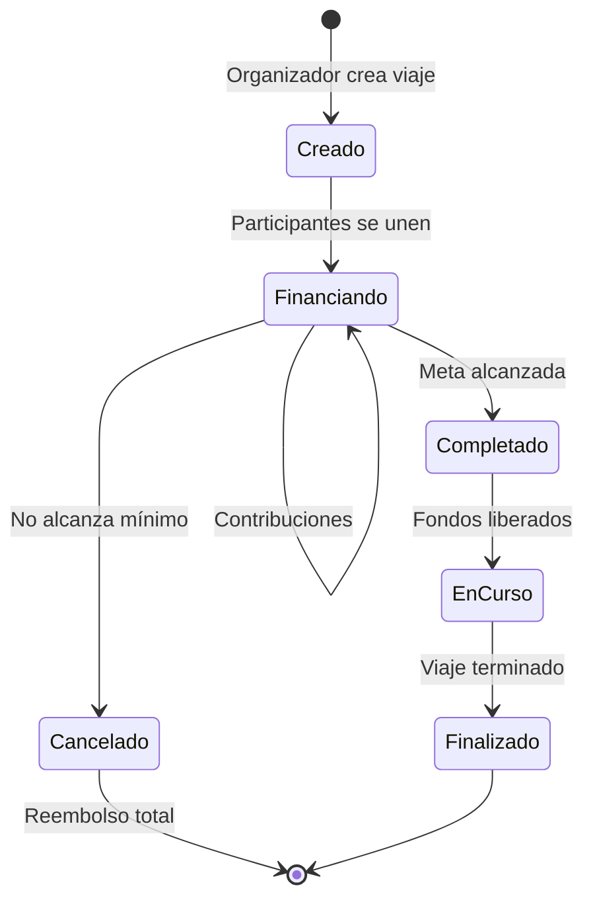

---

## Modelo de Datos

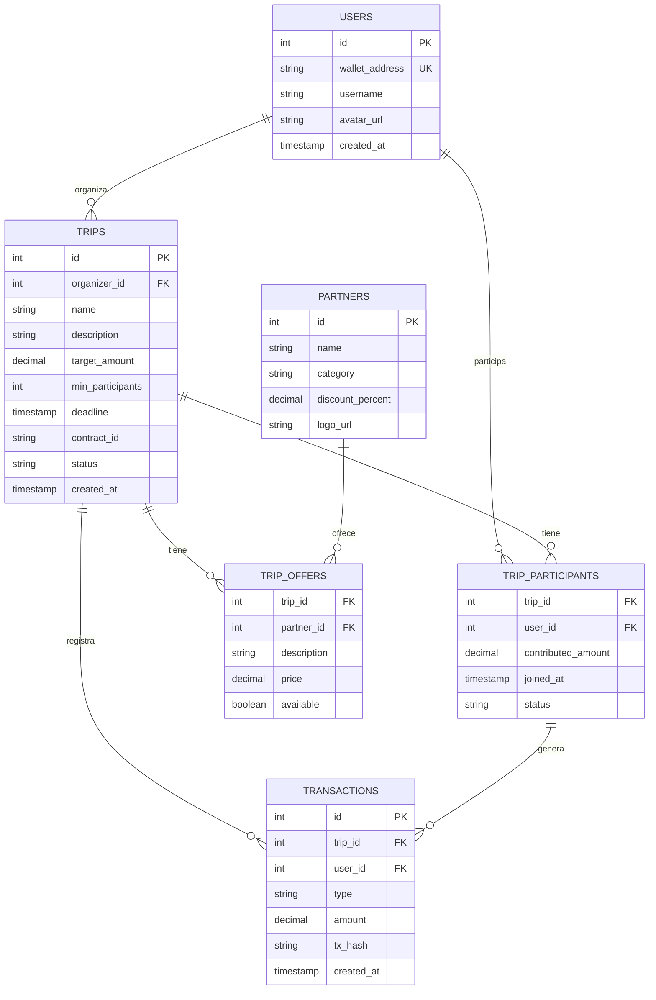

---

## Smart Contract - Funcionalidades

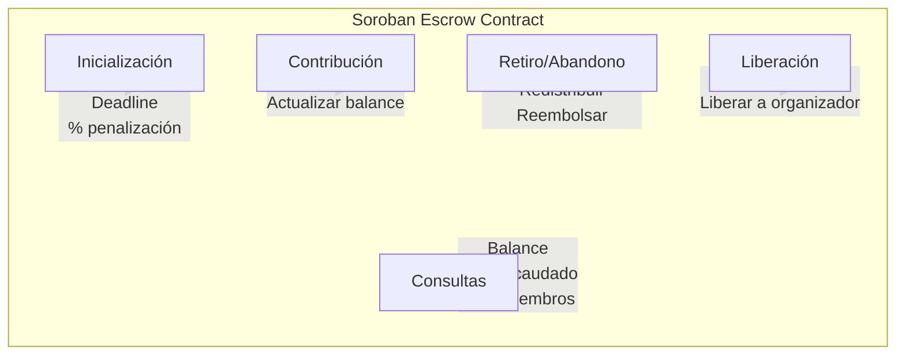

| Función             | Descripción                                                                           |
|---------------------|---------------------------------------------------------------------------------------|
| **Inicialización**  | Crear viaje con monto objetivo, mínimo de participantes, deadline y % de penalización |
| **Contribución**    | Recibir fondos de participantes y actualizar balances                                 |
| **Retiro/Abandono** | Calcular penalización, redistribuir al grupo, reembolsar                              |
| **Liberación**      | Liberar fondos al organizador cuando se cumple la meta                                |
| **Consultas**       | Balance por participante, total recaudado, lista de miembros                          |

---

## Integraciones Externas

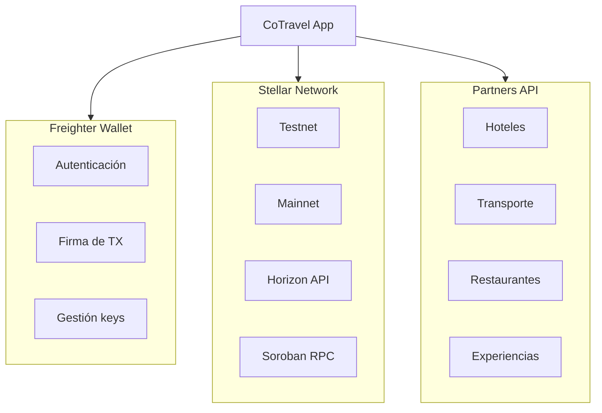

---

## Seguridad

| Aspecto         | Implementación                            |
|-----------------|-------------------------------------------|
| Autenticación   | Wallet-based (Freighter)                  |
| Autorización    | Verificación de firma en cada transacción |
| Fondos          | Custodia en smart contract, no en backend |
| Datos sensibles | Encriptación en tránsito (HTTPS) y reposo |
| Contratos       | Auditoría antes de mainnet                |

---

## Ambientes

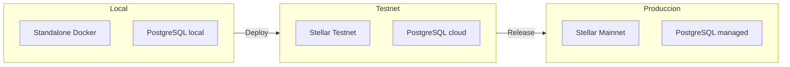

| Ambiente   | Red Stellar         | Base de datos      | Uso             |
|------------|---------------------|--------------------|-----------------|
| Local      | Standalone (Docker) | PostgreSQL local   | Desarrollo      |
| Testnet    | Stellar Testnet     | PostgreSQL cloud   | QA / Staging    |
| Producción | Stellar Mainnet     | PostgreSQL managed | Usuarios reales |

---

## Próximos Pasos

- [ ] Inicializar frontend con Stellar Scaffold
- [ ] Crear contrato de escrow básico en Soroban
- [ ] Implementar API de viajes y participantes
- [ ] Integrar Freighter Wallet
- [ ] Diseñar flujo de invitaciones por link
- [ ] Desarrollar módulo de partners y ofertas
- [ ] Testing en testnet con usuarios reales
