# CoTravel - Arquitectura Técnica

> La forma más simple de organizar viajes grupales y gestionar presupuestos compartidos con escrow en blockchain.

---

## Visión General

CoTravel es una plataforma que permite a grupos de amigos coordinar viajes, recolectar contribuciones hacia un
presupuesto compartido y aplicar reglas justas mediante smart contracts en Stellar/Soroban.

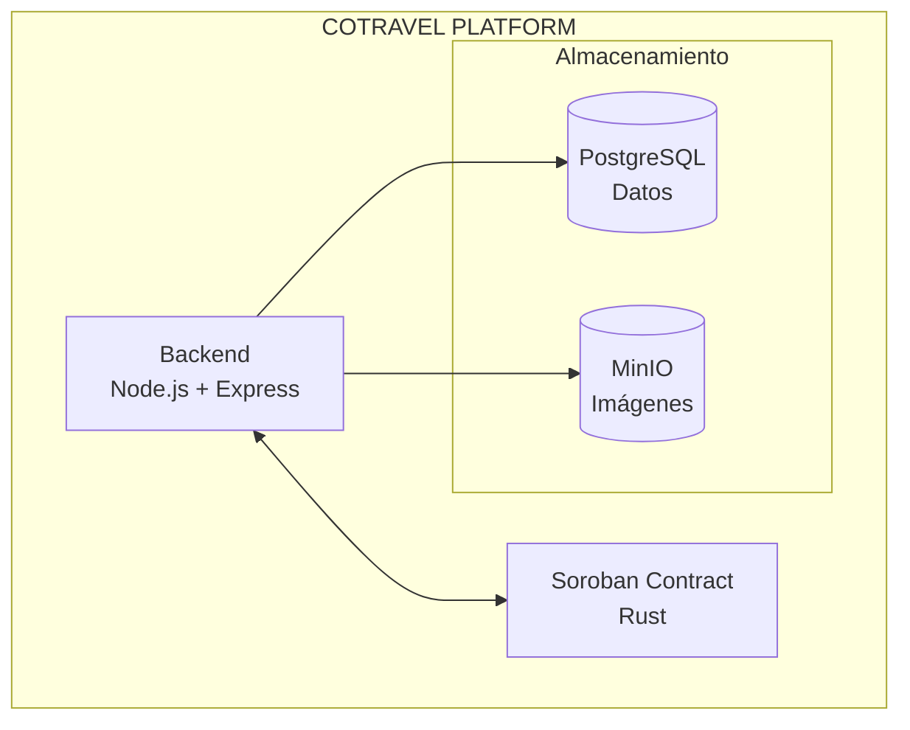

---

## Stack Tecnológico

| Componente     | Tecnología                 | Propósito                                             |
|----------------|----------------------------|-------------------------------------------------------|
| Backend        | Node.js + Express          | API REST, lógica de negocio, integración con partners |
| Base de datos  | PostgreSQL                 | Usuarios, grupos, viajes, transacciones               |
| Almacenamiento | MinIO (S3 compatible)      | Imágenes de perfil, fotos de viajes                   |
| Smart Contract | Soroban (Rust)             | Escrow, milestones, reembolsos automáticos            |
| Blockchain     | Stellar Network            | Transacciones, wallets grupales                       |

---

## Estructura del Proyecto

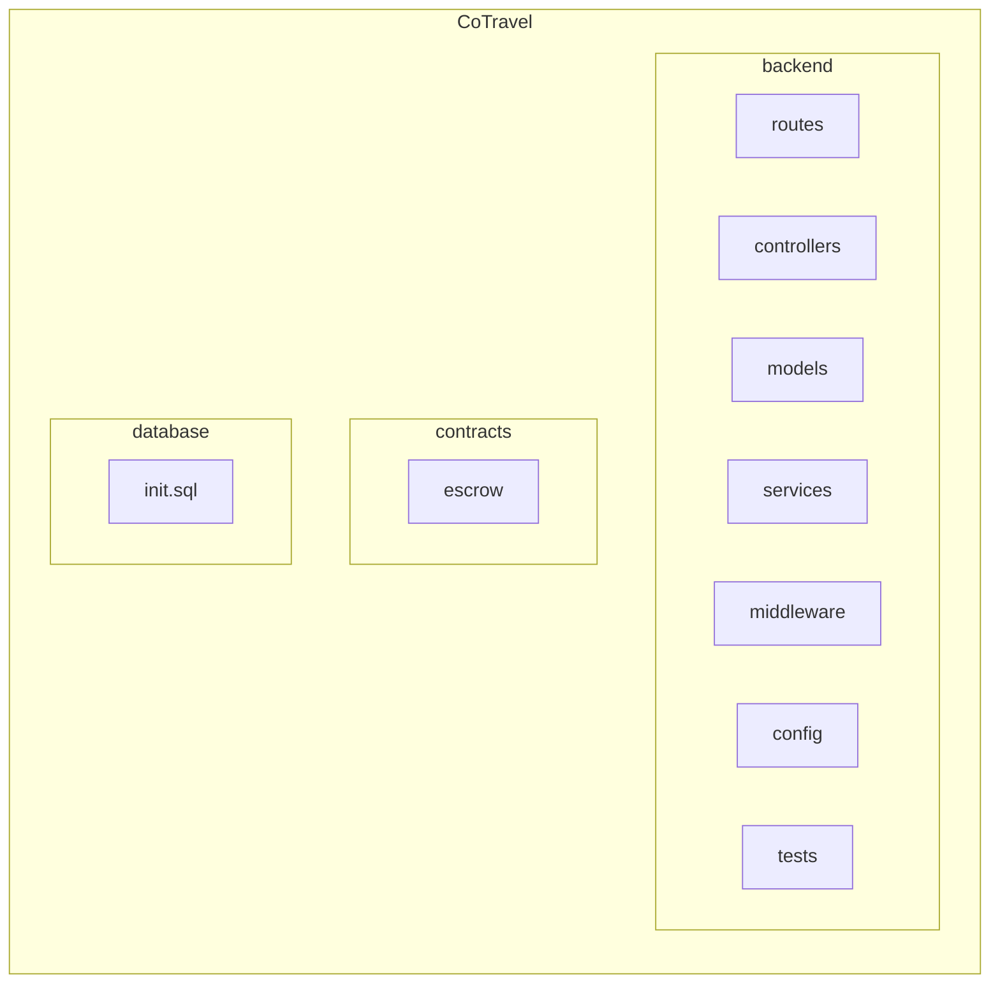

---

## Servicios Docker

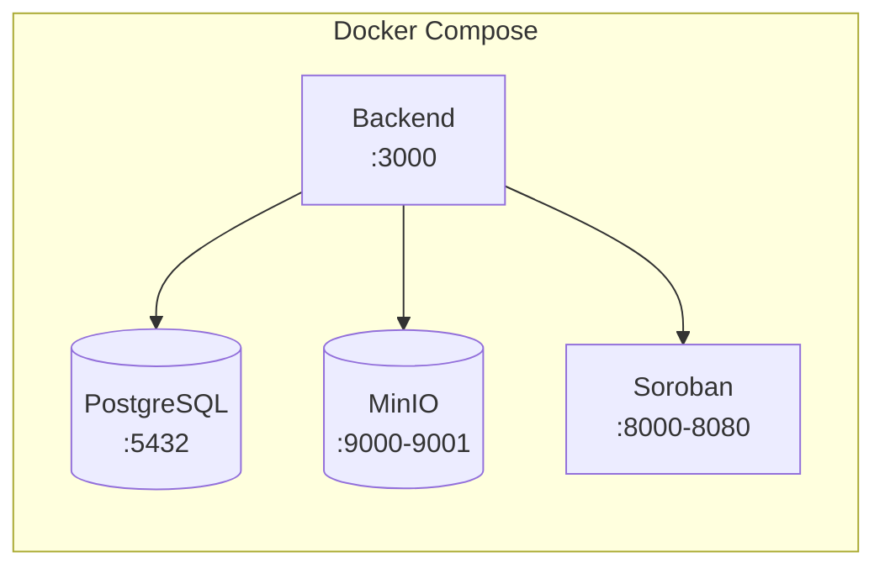

| Servicio   | Puerto      | Descripción               |
|------------|-------------|---------------------------|
| Backend    | 3000        | API REST                  |
| PostgreSQL | 5432        | Base de datos relacional  |
| MinIO      | 9000 / 9001 | Almacenamiento de objetos |
| Soroban    | 8000 / 8080 | Red local Stellar + RPC   |

---

## Backend API

### Arquitectura

El backend sigue un patrón **MVC** con separación clara de responsabilidades:

```
backend/
├── src/
│   ├── app.js              ← Express app exportable (sin listen)
│   ├── index.js             ← Punto de entrada: init DB/MinIO + listen
│   ├── config/
│   │   ├── db.js            ← Pool de PostgreSQL (singleton)
│   │   ├── minio.js         ← Cliente MinIO + inicialización de buckets
│   │   └── soroban.js       ← Soroban RPC Server + config de red
│   ├── middleware/
│   │   ├── auth.js          ← JWT: requireAuth, requireOrganizer, loadTrip
│   │   └── errorHandler.js  ← Manejo centralizado de errores
│   ├── routes/
│   │   ├── auth.js          ← /api/auth (challenge, login, me)
│   │   ├── health.js        ← /health (status DB + storage)
│   │   ├── images.js        ← /images (upload, get, list)
│   │   ├── trips.js         ← /api/trips (CRUD + contract ops)
│   │   └── users.js         ← /api/users (create, get)
│   ├── controllers/
│   │   ├── authController.js
│   │   ├── imagesController.js
│   │   ├── participantsController.js
│   │   ├── tripsController.js
│   │   └── usersController.js
│   ├── models/
│   │   ├── imageModel.js
│   │   ├── participantModel.js
│   │   ├── transactionModel.js
│   │   ├── tripModel.js
│   │   └── userModel.js
│   └── services/
│       └── sorobanService.js ← Read-only queries + submitTx
├── tests/                    ← Integration tests (Jest + Supertest)
├── jest.config.js
└── package.json
```

### Autenticación

Challenge-response con firma de wallet Stellar + JWT:

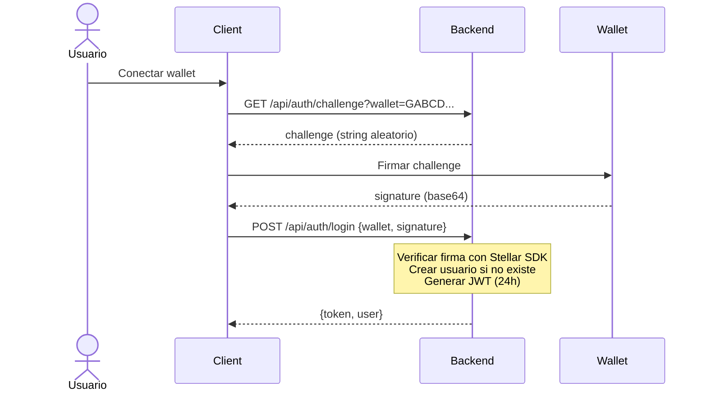

### Endpoints

| Método | Ruta                           | Auth            | Descripción                          |
|--------|--------------------------------|-----------------|--------------------------------------|
| `GET`  | `/`                            | -               | Health check (API running)           |
| `GET`  | `/health`                      | -               | Health check (DB + storage)          |
| `GET`  | `/api/auth/challenge`          | -               | Obtener challenge para wallet        |
| `POST` | `/api/auth/login`              | -               | Login con firma → JWT                |
| `GET`  | `/api/auth/me`                 | JWT             | Usuario autenticado                  |
| `POST` | `/api/users`                   | -               | Crear usuario                        |
| `GET`  | `/api/users/:wallet`           | -               | Buscar usuario por wallet            |
| `GET`  | `/api/trips`                   | -               | Listar viajes                        |
| `POST` | `/api/trips`                   | JWT             | Crear viaje (draft)                  |
| `GET`  | `/api/trips/:id`               | -               | Detalle de viaje (+ estado on-chain) |
| `GET`  | `/api/trips/:id/participants`  | -               | Listar participantes                 |
| `POST` | `/api/trips/:id/join`          | JWT             | Unirse a viaje                       |
| `POST` | `/api/trips/:id/contribute`    | JWT             | Contribuir (submit XDR)              |
| `POST` | `/api/trips/:id/withdraw`      | JWT             | Retirarse (submit XDR)               |
| `POST` | `/api/trips/:id/link-contract` | JWT + Organizer | Vincular contrato Soroban            |
| `POST` | `/api/trips/:id/release`       | JWT + Organizer | Liberar fondos                       |
| `POST` | `/api/trips/:id/cancel`        | JWT + Organizer | Cancelar viaje                       |
| `POST` | `/images/upload`               | -               | Subir imagen (MinIO)                 |
| `GET`  | `/images/:filename`            | -               | Obtener imagen (stream)              |
| `GET`  | `/images`                      | -               | Listar imágenes                      |

### Arquitectura Híbrida (Off-chain + On-chain)

El backend actúa como **intermediario** entre el cliente y la blockchain:

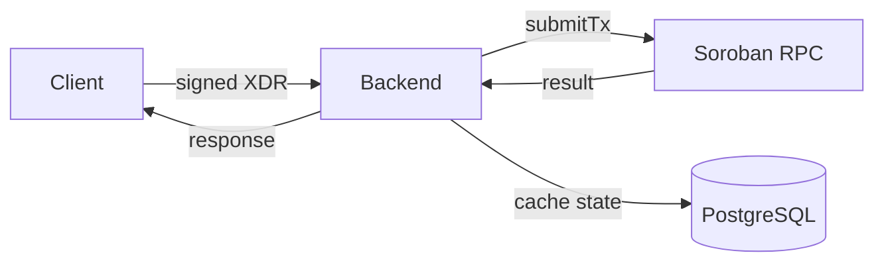

- **Off-chain (PostgreSQL)**: Usuarios, metadata de viajes, historial de transacciones, estado cacheado
- **On-chain (Soroban)**: Escrow real, balances, reglas de negocio (penalización, release, cancel)
- **Source of truth**: El contrato Soroban es la fuente de verdad para fondos y estado financiero

---

## Testing

### Stack de Testing

| Herramienta | Propósito                                            |
|-------------|------------------------------------------------------|
| Jest        | Framework de testing (assertions, mocks, lifecycle)  |
| Supertest   | Peticiones HTTP al Express app sin levantar servidor |

### Arquitectura de Tests

```
Real (Docker)              Mockeado
─────────────              ────────
PostgreSQL ✓               sorobanService.submitTx
MinIO ✓                    sorobanService.getTripState
Express routing ✓
JWT auth ✓
Stellar SDK (firma) ✓
```

**Aislamiento de DB**: Cada test corre dentro de `BEGIN` / `ROLLBACK`. La base de datos nunca se contamina entre tests.

**Aislamiento de MinIO**: Los tests de imágenes limpian objetos subidos en `afterEach`.

### Test Suites (48 tests)

| Suite                  | Tests | Cobertura                                                     |
|------------------------|-------|---------------------------------------------------------------|
| `health.test.js`       | 2     | Smoke test: API + DB + storage                                |
| `auth.test.js`         | 11    | Challenge, login, firma, JWT, /me                             |
| `users.test.js`        | 5     | CRUD usuarios                                                 |
| `trips.test.js`        | 15    | CRUD viajes + link-contract + release/cancel + auth organizer |
| `participants.test.js` | 10    | Join, contribute, withdraw + auto-join                        |
| `images.test.js`       | 5     | Upload/get/list con MinIO real                                |

### Ejecución

```bash
# Requisito: containers Docker corriendo
docker compose up -d postgres minio backend

# Ejecutar tests dentro del container
docker compose exec backend npm test
```

---

## Flujos Principales

### 1. Creación de Viaje Grupal

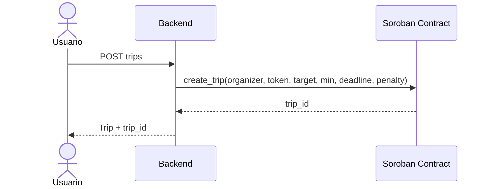

> **Nota**: Se usa un único contrato multi-escrow. No se despliega un contrato nuevo por viaje, solo se invoca
`create_trip()` que retorna un `trip_id`.

### 2. Contribución al Presupuesto

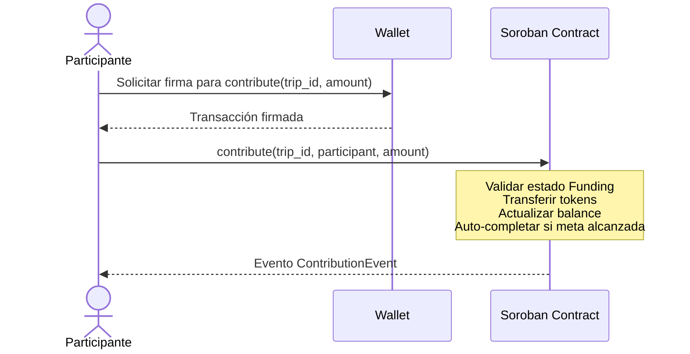

### 3. Abandono con Penalización

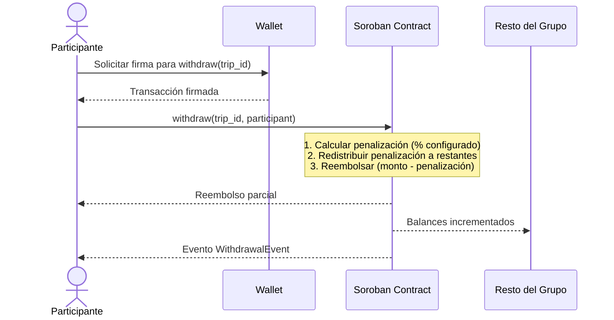

### 4. Cancelación por Organizador

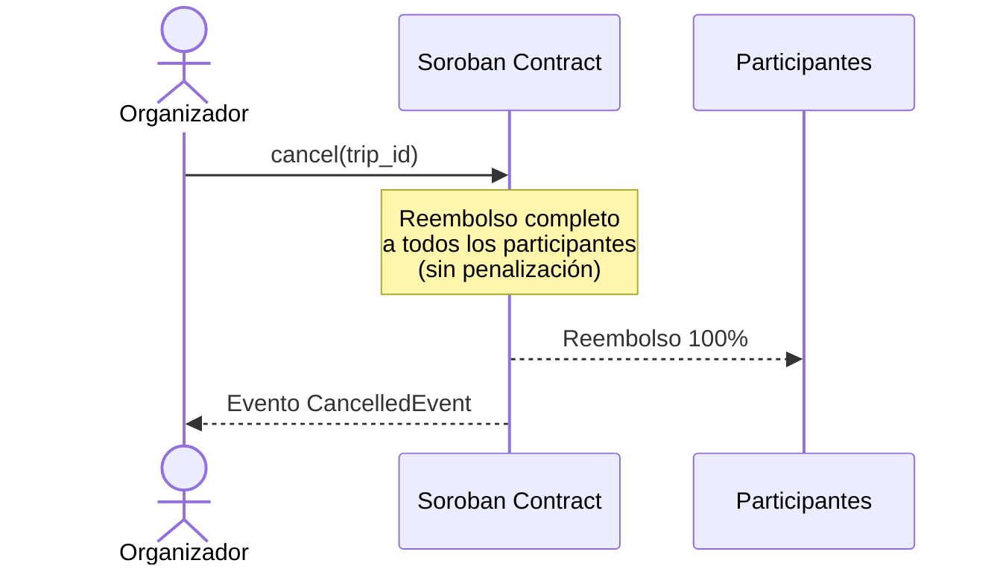

---

## Ciclo de Vida del Viaje

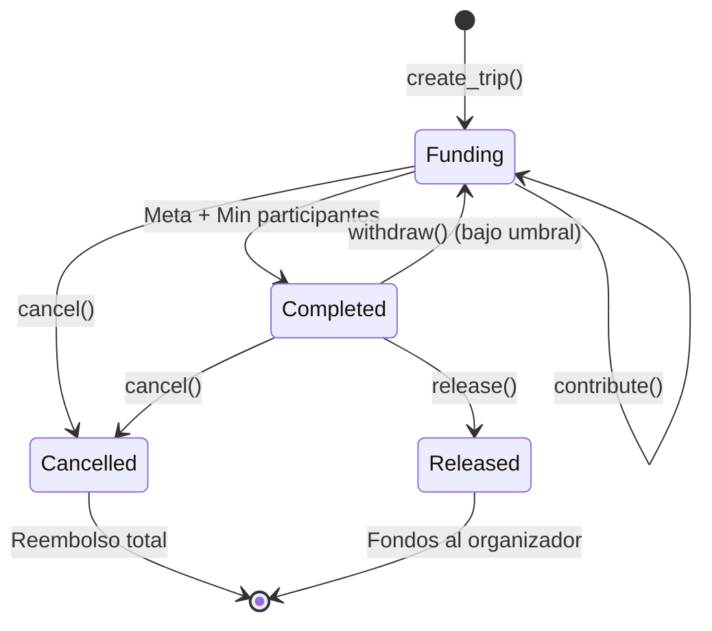

**Transiciones de estado en el contrato:**

- `Funding` → `Completed`: Cuando `total >= target` Y `participants >= min_participants`
- `Completed` → `Funding`: Si un withdraw reduce por debajo del umbral
- `Funding/Completed` → `Cancelled`: Solo el organizador puede cancelar
- `Completed` → `Released`: Solo el organizador puede liberar

---

## Modelo de Datos

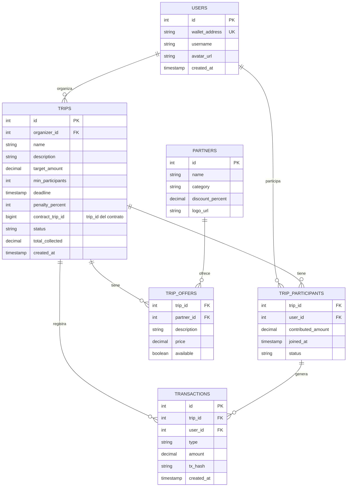

---

## Smart Contract - Arquitectura Multi-Escrow

El contrato utiliza un patrón **multi-escrow**: un único contrato desplegado gestiona N viajes independientes mediante
`trip_id`.

### ¿Por qué Multi-Escrow?

| Aspecto     | Factory (1 contrato/viaje)  | Multi-Escrow (1 contrato, N viajes) |
|-------------|-----------------------------|-------------------------------------|
| Deploy      | Despliega WASM cada vez     | Un solo deploy                      |
| Costo       | ~100k stroops/viaje         | Solo costo de storage               |
| Complejidad | Requiere factory + tracking | Lógica simple con trip_id           |
| Aislamiento | Total (contratos separados) | Por storage key (TripKey enum)      |

### Storage del Contrato

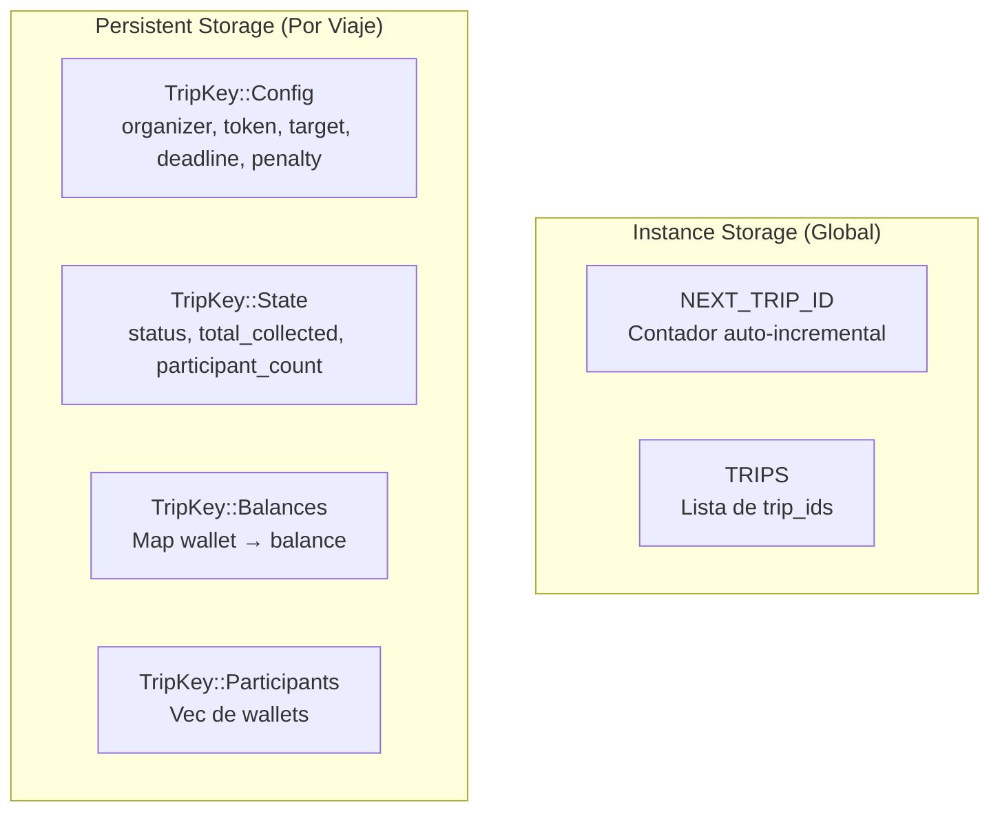

### API del Contrato

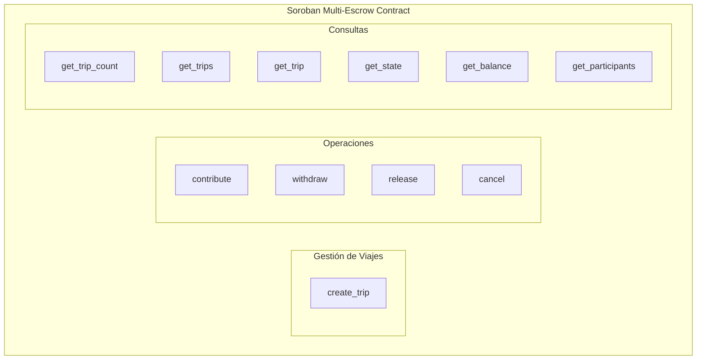

| Función            | Parámetros                                                    | Descripción                                    |
|--------------------|---------------------------------------------------------------|------------------------------------------------|
| `create_trip`      | organizer, token, target, min_participants, deadline, penalty | Crear viaje, retorna `trip_id`                 |
| `contribute`       | trip_id, participant, amount                                  | Aportar fondos (auto-completa si alcanza meta) |
| `withdraw`         | trip_id, participant                                          | Retirarse con penalización redistribuida       |
| `release`          | trip_id                                                       | Liberar fondos al organizador (solo Completed) |
| `cancel`           | trip_id                                                       | Cancelar y reembolsar todo (sin penalización)  |
| `get_trip_count`   | -                                                             | Total de viajes creados                        |
| `get_trips`        | -                                                             | Lista de todos los trip_id                     |
| `get_trip`         | trip_id                                                       | Info resumida del viaje                        |
| `get_state`        | trip_id                                                       | Estado actual (status, totales)                |
| `get_balance`      | trip_id, participant                                          | Balance de un participante                     |
| `get_participants` | trip_id                                                       | Lista de participantes del viaje               |

### Contrato Desplegado (Testnet)

| Dato        | Valor                                                      |
|-------------|------------------------------------------------------------|
| Contract ID | `CBZJNP3KVSWCTRQJNF6Y5P55WDIGZ5JSABKDZ4RBGLFUMFZQK5BKFBIC` |
| Token (XLM) | `CDLZFC3SYJYDZT7K67VZ75HPJVIEUVNIXF47ZG2FB2RMQQVU2HHGCYSC` |
| Network     | Test SDF Network ; September 2015                          |

---

## Integraciones Externas

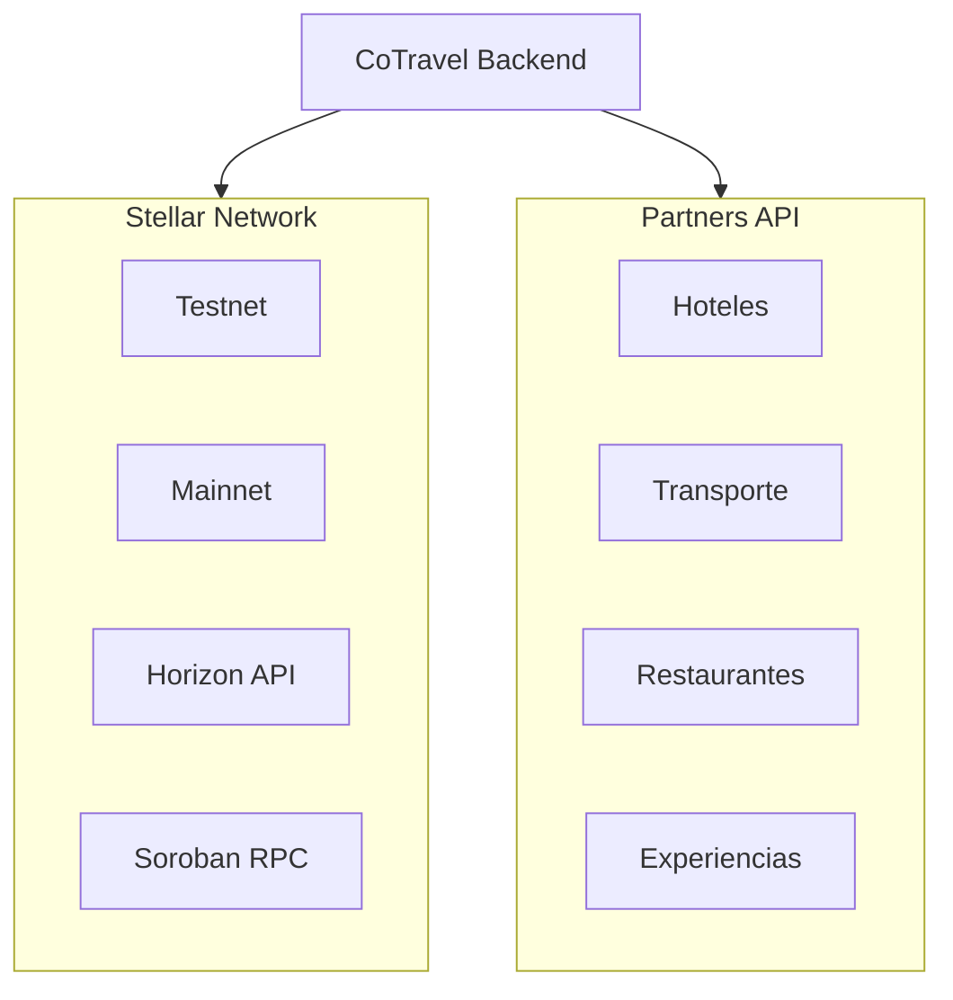

---

## Seguridad

| Aspecto         | Implementación                                         |
|-----------------|--------------------------------------------------------|
| Autenticación   | Challenge-response con firma Stellar + JWT (24h)       |
| Autorización    | Middleware `requireAuth` + `requireOrganizer` por ruta |
| Fondos          | Custodia en smart contract, no en backend              |
| Firma de TX     | Cliente firma con wallet, backend solo retransmite XDR |
| Datos sensibles | JWT_SECRET configurable, HTTPS en producción           |
| Contratos       | Auditoría antes de mainnet                             |

---

## Ambientes

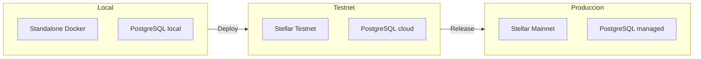

| Ambiente   | Red Stellar         | Base de datos      | Uso             |
|------------|---------------------|--------------------|-----------------|
| Local      | Standalone (Docker) | PostgreSQL local   | Desarrollo      |
| Testnet    | Stellar Testnet     | PostgreSQL cloud   | QA / Staging    |
| Producción | Stellar Mainnet     | PostgreSQL managed | Usuarios reales |

---

## Próximos Pasos

### Completado ✅

- [x] Crear contrato multi-escrow en Soroban (Rust)
- [x] Desplegar contrato en testnet
- [x] Tests unitarios del contrato (6 tests)
- [x] Makefile con comandos de desarrollo
- [x] Documentación del contrato (README.md)
- [x] Base de datos PostgreSQL (schema completo, 7 tablas, verificada)
- [x] Documentación de base de datos (README.md + Supabase)
- [x] Variables de entorno documentadas en README
- [x] Backend API REST completa (Express + 5 rutas, 5 controllers, 5 models)
- [x] Autenticación challenge-response con Stellar wallet + JWT
- [x] Integración con Soroban (submitTx, read-only queries)
- [x] Almacenamiento de imágenes con MinIO (upload, stream, list)
- [x] Middleware de autorización (requireAuth, requireOrganizer, loadTrip)
- [x] Tests de integración con Jest + Supertest (48 tests, 6 suites)
- [x] Aislamiento de tests con transaction rollback (BEGIN/ROLLBACK)
- [x] Docker Compose completo (PostgreSQL, MinIO, Backend, Soroban)

### Pendiente 📋

- [ ] Inicializar frontend (desde cero)
- [ ] Integrar wallet Stellar
- [ ] Conectar frontend con backend API + contrato
- [ ] Indexar eventos del contrato para sincronizar con DB
- [ ] Diseñar flujo de invitaciones por link
- [ ] Desarrollar módulo de partners y ofertas
- [ ] Testing en testnet con usuarios reales
