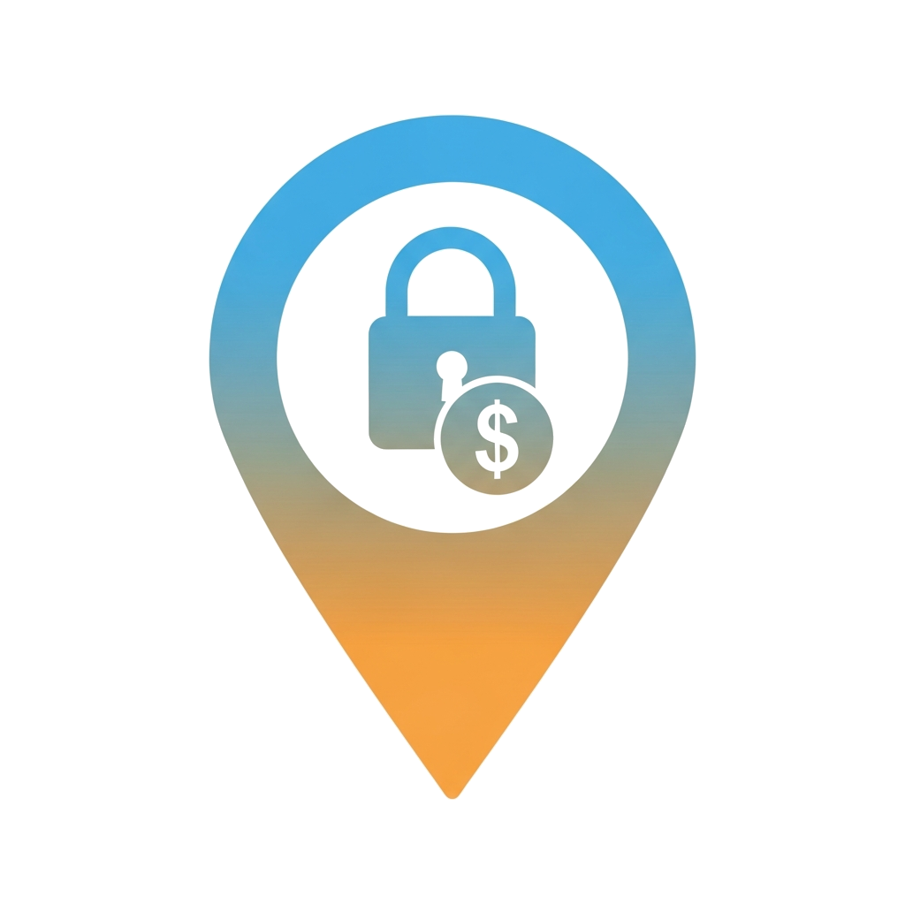
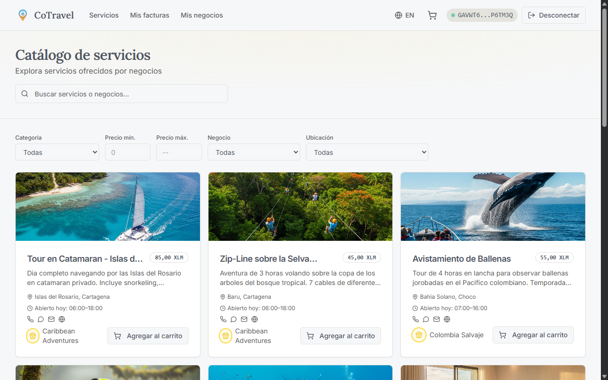
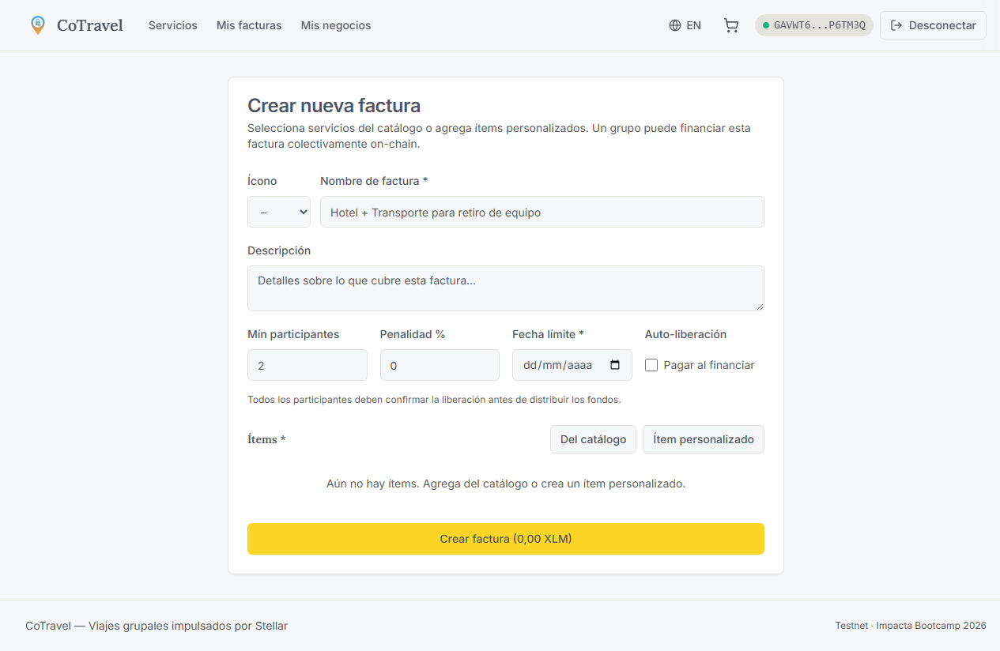
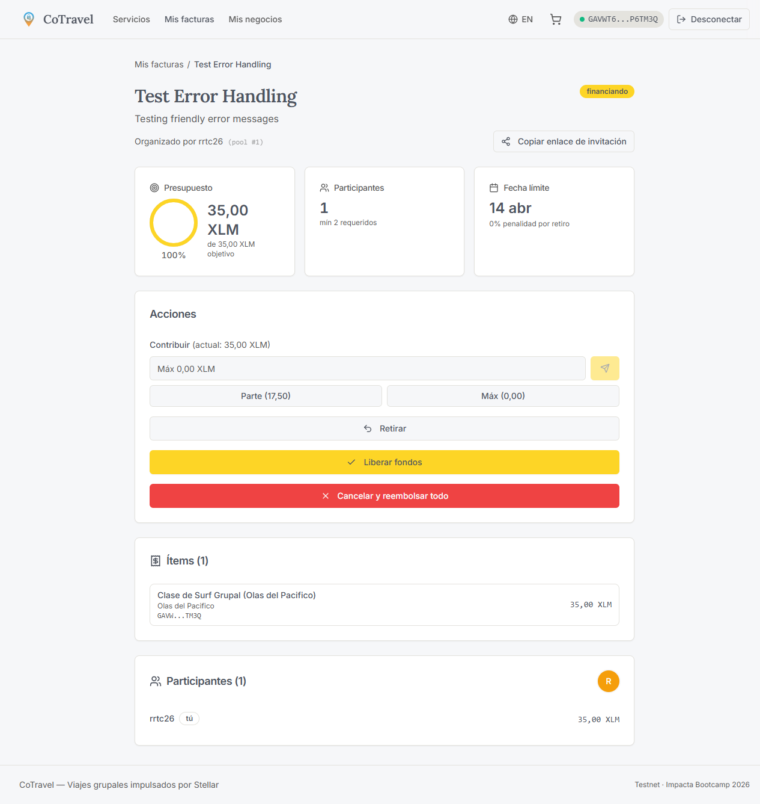
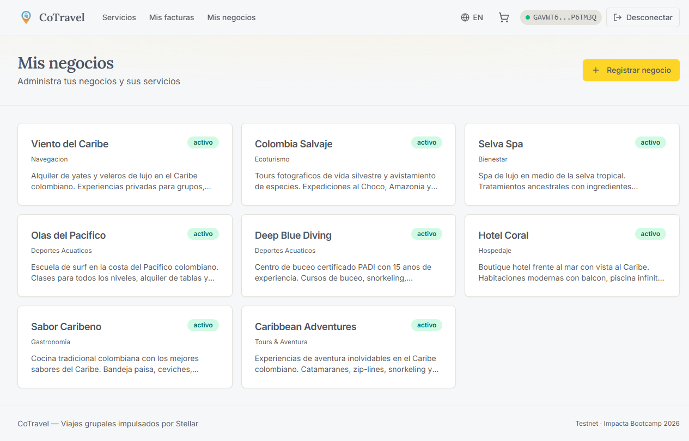
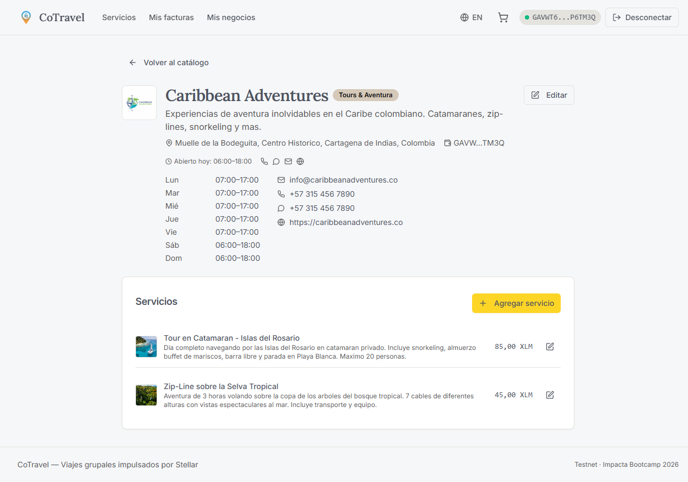
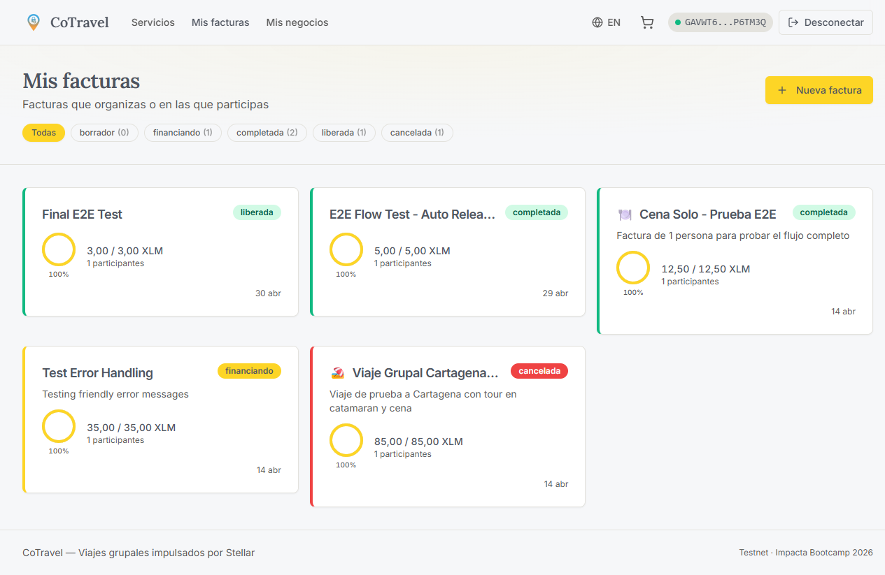
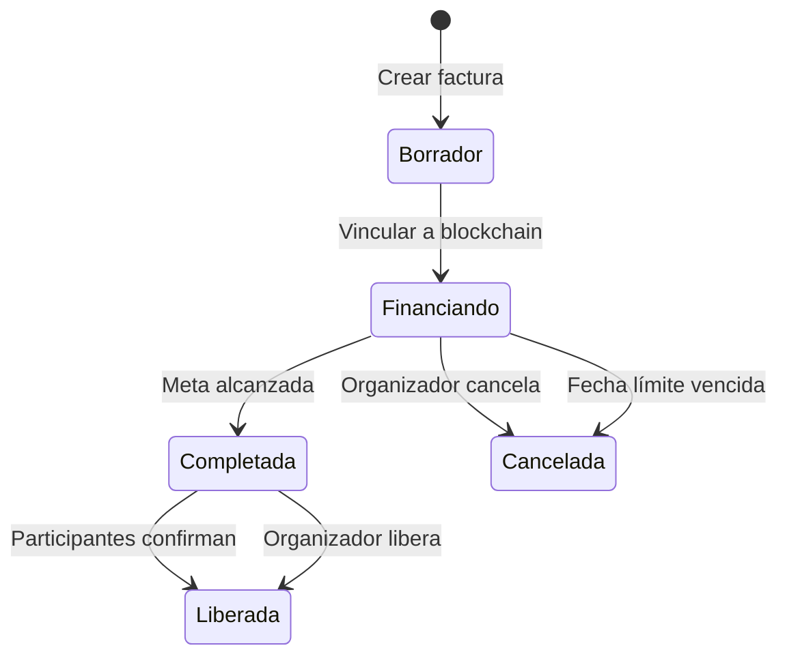

  

<h1 align="center">CoTravel</h1>

<h3 align="center">Viajes grupales con pagos compartidos en blockchain</h3>

  
  
  

  <a href="https://cotravel.up.railway.app">Ver demo en vivo</a>

---

> **Stellar Give x Stellar Impacta Bootcamp** — Proyecto desarrollado como parte de la iniciativa **Stellar Give**
> dentro del **Stellar Impacta Bootcamp**, un programa del Stellar Community Fund enfocado en construir
> soluciones blockchain con impacto real sobre la red Stellar.

---

## El problema

Organizar viajes en grupo es complicado. Recolectar dinero, coordinar presupuestos y manejar cancelaciones termina en
chats interminables, hojas de cálculo y problemas de confianza. Cuando alguien se retira, el viaje entero se complica y
todos pierden tiempo y dinero.

## La solución

CoTravel es una plataforma donde los grupos financian viajes de forma colectiva usando un contrato inteligente en
Stellar. Cada participante contribuye a un fondo compartido con reglas claras: monto objetivo, fecha límite, penalidades
por retiro y distribución automática de pagos a los proveedores (hoteles, tours, restaurantes).

**Sin intermediarios. Sin confianza ciega. Todo transparente en blockchain.**

---

## Cómo funciona

### 1. Explora servicios de viaje

Busca hoteles, tours, restaurantes y experiencias registradas en la plataforma. Filtra por categoría, precio o
ubicación.

  

### 2. Crea una factura grupal

Selecciona servicios del catálogo o agrega ítems personalizados. Define el número mínimo de participantes, fecha límite
y reglas de penalidad.

  

### 3. El grupo contribuye

Comparte el enlace de invitación. Cada participante se une y aporta su parte. El progreso se muestra en tiempo real con
el porcentaje financiado.

  

### 4. Fondos liberados automáticamente

Cuando se alcanza la meta y todos confirman, el contrato inteligente distribuye los fondos directamente a las wallets de
los proveedores. Sin intermediarios.

  

---

## Características principales

| Característica                 | Descripción                                                                                     |
|--------------------------------|-------------------------------------------------------------------------------------------------|
| **Pagos en grupo**             | Los participantes contribuyen al fondo compartido desde sus wallets                             |
| **Reglas automáticas**         | Penalidades por retiro, fechas límite y montos mínimos gestionados por el contrato              |
| **Pago directo a proveedores** | Los fondos van directamente a las wallets de hoteles, tours y restaurantes                      |
| **Confirmación colectiva**     | Todos los participantes deben aprobar la liberación de fondos (o el organizador puede forzarla) |
| **Reembolso automático**       | Si el grupo no alcanza la meta antes de la fecha límite, todos reciben su dinero de vuelta      |
| **Login flexible**             | Conecta con wallet Freighter o inicia sesión con Google                                         |

---

## Gestión de negocios

Los proveedores de servicios de viaje pueden registrar su negocio, agregar servicios con precios en XLM, horarios de
atención e información de contacto.

  

  

## Panel de facturas

Visualiza todas tus facturas organizadas por estado: borrador, financiando, completada, liberada o cancelada.

  

---

## Flujo de una factura

---

## Audiencia

| Segmento                     | Descripción                                                                          |
|------------------------------|--------------------------------------------------------------------------------------|
| **Grupos de amigos (18-35)** | Planean viajes juntos y necesitan una forma fácil de recolectar y administrar dinero |
| **Organizadores de viaje**   | Coordinan presupuestos y reglas con total transparencia                              |
| **Viajeros frecuentes**      | Viajes de graduación, festivales, escapadas — múltiples viajes por año               |
| **Negocios asociados**       | Hoteles, restaurantes, tours — reciben pagos directos y atraen grupos                |

## Modelo de negocio

1. **Comisiones por transacción** en viajes de alto presupuesto
2. **Comisiones de socios** (B2B2C) por reservas a través de la plataforma
3. **Posicionamiento premium** para negocios que quieran destacar sus ofertas

---

## Perfil

|               |                                      |
|---------------|--------------------------------------|
| **Ubicación** | Bogotá, Colombia                     |
| **Red**       | Stellar (Testnet)                    |
| **Etapa**     | Prototipo                            |
| **Sector**    | Web3 / Travel                        |
| **LinkedIn**  | https://www.linkedin.com/in/cotravel |
| **X**         | https://x.com/CoTraveel              |

---

  Construido con Stellar &bull; Soroban &bull; Freighter 
  <strong>Stellar Give x Stellar Impacta Bootcamp 2026</strong>

