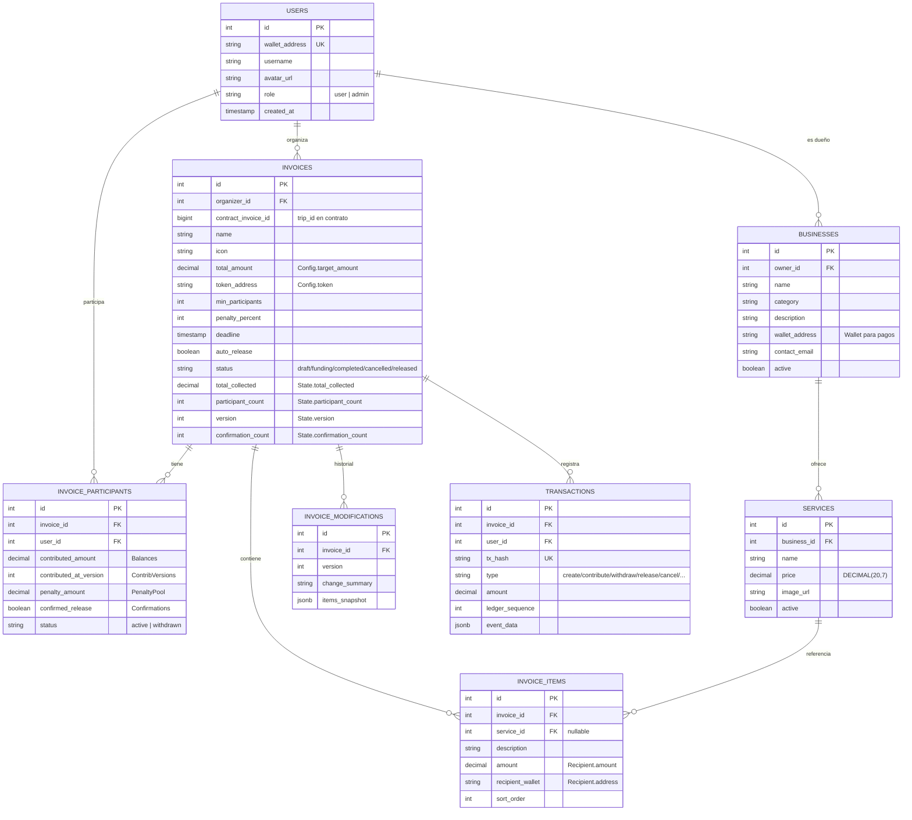

# CoTravel - Arquitectura Técnica

> Plataforma de pagos grupales con escrow en blockchain: organiza facturas compartidas, recolecta contribuciones y
> distribuye pagos a múltiples destinatarios via Stellar/Soroban.

---

## Visión General

CoTravel permite a grupos coordinar pagos compartidos. Un organizador crea una factura con múltiples destinatarios (
servicios, empresas), los participantes contribuyen fondos a un escrow on-chain, y al completarse se distribuyen los
pagos automáticamente.


---

## Stack Tecnológico

| Componente     | Tecnología                   | Propósito                                                |
|----------------|------------------------------|----------------------------------------------------------|
| Frontend       | React 19 + Vite 6 + Tailwind | SPA con 16 vistas, wallet integration, tx builders       |
| Backend        | Node.js + Express            | API REST, lógica de negocio, integración con contrato    |
| Base de datos  | PostgreSQL 16                | Usuarios, empresas, servicios, facturas, transacciones   |
| Almacenamiento | MinIO (S3 compatible)        | Imágenes de perfil, logos                                |
| Smart Contract | Soroban (Rust)               | Escrow multi-pool, distribución de pagos, penalizaciones |
| Blockchain     | Stellar Network              | Transacciones, wallets, tokens                           |
| Auth           | Freighter (SEP-0053) + JWT   | Challenge-response + token 24h                           |

---

## Estructura del Proyecto

```
CoTravel/
├── frontend/
│   └── src/
│       ├── pages/                 ← 12 vistas + 4 admin
│       │   ├── Landing.tsx
│       │   ├── InvoiceDashboard.tsx
│       │   ├── CreateInvoice.tsx
│       │   ├── InvoiceDetail.tsx     ← Ciclo de vida completo del escrow
│       │   ├── ServiceCatalog.tsx
│       │   ├── MyBusinesses.tsx
│       │   ├── RegisterBusiness.tsx
│       │   ├── BusinessProfile.tsx
│       │   ├── EditBusiness.tsx
│       │   ├── AddService.tsx
│       │   ├── EditService.tsx
│       │   ├── Profile.tsx
│       │   └── admin/               ← URL oculta /admin (rol admin)
│       │       ├── AdminDashboard.tsx
│       │       ├── AdminUsers.tsx
│       │       ├── AdminBusinesses.tsx
│       │       └── AdminInvoices.tsx
│       ├── components/
│       │   ├── layout/              ← Layout, Header (mobile nav), Footer
│       │   ├── invoice/             ← ProgressBar, ItemsList, ServicePicker, ModificationBanner
│       │   ├── wallet/              ← ConnectButton (Freighter)
│       │   └── ui/                  ← Button, Card, Badge (shadcn-style)
│       ├── lib/
│       │   ├── soroban.ts           ← 8 transaction builders + sign con Freighter
│       │   └── utils.ts             ← cn(), truncateAddress(), formatXLM()
│       ├── services/api.ts          ← 37 funciones API tipadas
│       ├── stores/walletStore.ts    ← Zustand: wallet, JWT, user (persistido)
│       ├── hooks/useAuth.ts         ← Freighter connect + auth flow
│       ├── types/index.ts           ← 15 interfaces alineadas con backend
│       └── App.tsx                  ← Router (16 rutas)
├── backend/
│   └── src/
│       ├── app.js                 ← Express app (sin listen)
│       ├── index.js               ← Punto de entrada: init DB/MinIO + listen
│       ├── config/
│       │   ├── db.js              ← Pool de PostgreSQL
│       │   ├── logger.js          ← Pino logger con request IDs
│       │   ├── minio.js           ← Cliente MinIO
│       │   └── soroban.js         ← Soroban RPC Server + config de red
│       ├── middleware/
│       │   ├── auth.js            ← JWT: requireAuth, loadInvoice, loadBusiness, etc.
│       │   └── errorHandler.js    ← Manejo centralizado de errores
│       ├── routes/
│       │   ├── auth.js            ← /api/auth (challenge, login, me)
│       │   ├── admin.js           ← /api/admin (stats, users, businesses, invoices)
│       │   ├── businesses.js      ← /api/businesses (CRUD + my/list)
│       │   ├── services.js        ← /api/services (CRUD + búsqueda)
│       │   ├── invoices.js        ← /api/invoices (CRUD + lifecycle + participants)
│       │   ├── users.js           ← /api/users (create, get)
│       │   ├── images.js          ← /images (upload, get, list)
│       │   └── health.js          ← /health
│       ├── controllers/           ← Lógica de negocio por entidad
│       ├── models/                ← Queries a PostgreSQL por tabla
│       └── services/
│           └── sorobanService.js  ← submitTx + read queries al contrato
├── contracts/
│   └── cotravel-escrow/           ← Soroban smart contract (Rust)
│       ├── src/lib.rs             ← Contrato principal (9 write + 10 read)
│       ├── Cargo.toml
│       └── Makefile               ← Build, test, deploy, demo
├── database/
│   └── init.sql                   ← Schema PostgreSQL (8 tablas, 18 índices)
└── docker-compose.yml             ← 6 servicios
```

---

## Servicios Docker

| Servicio    | Puerto      | Descripción                                             |
|-------------|-------------|---------------------------------------------------------|
| Frontend    | 5173        | Vite dev server (React + Tailwind) con proxy al backend |
| Backend     | 3000        | API REST (Node.js + Express)                            |
| PostgreSQL  | 5432        | Base de datos relacional                                |
| MinIO       | 9000 / 9001 | Almacenamiento de objetos (S3 compatible)               |
| Soroban     | 8000 / 8080 | Nodo Stellar (Horizon + Soroban RPC)                    |
| Soroban Dev | —           | CLI Rust + Stellar CLI para compilar/deploy             |

---

## Arquitectura Híbrida (Off-chain + On-chain)


**Responsabilidades:**

| Capa           | Responsabilidad                                                    |
|----------------|--------------------------------------------------------------------|
| Frontend       | Construir TX Soroban, simular, firmar con Freighter, enviar XDR    |
| Backend        | Validar, retransmitir TX, sincronizar estado on-chain → PostgreSQL |
| PostgreSQL     | Cache off-chain: usuarios, metadata, historial, estado cacheado    |
| Smart Contract | Source of truth financiero: balances, escrow, distribución, reglas |

**El contrato Soroban es la fuente de verdad** para fondos y estado financiero.
PostgreSQL es un cache rápido para queries de UI.

---

## Autenticación

Challenge-response con firma de wallet Stellar (SEP-0053) + JWT:


**JWT Claims:** `id`, `wallet_address`, `role` (`user` | `admin`), `iss: cotravel-api`, `aud: cotravel-client`

---

## Frontend - Mapa de Vistas

### Públicas (sin autenticación)

| Ruta              | Vista            | API Endpoints usados                          |
|-------------------|------------------|-----------------------------------------------|
| `/`               | Landing          | —                                             |
| `/services`       | Service Catalog  | `GET /api/services?q=`                        |
| `/businesses/:id` | Business Profile | `GET /api/businesses/:id`, `GET .../services` |

### Autenticadas (wallet conectada)

| Ruta                           | Vista             | API Endpoints usados                                         |
|--------------------------------|-------------------|--------------------------------------------------------------|
| `/invoices`                    | Invoice Dashboard | `GET /api/invoices/my`                                       |
| `/invoices/new`                | Create Invoice    | `POST /api/invoices`, `GET /api/services`                    |
| `/invoices/:id`                | Invoice Detail    | `GET /api/invoices/:id`, `GET .../participants` + 8 acciones |
| `/businesses`                  | My Businesses     | `GET /api/businesses/my/list`                                |
| `/businesses/new`              | Register Business | `POST /api/businesses`                                       |
| `/businesses/:id/edit`         | Edit Business     | `PUT /api/businesses/:id`                                    |
| `/businesses/:id/services/new` | Add Service       | `POST /api/services`                                         |
| `/services/:id/edit`           | Edit Service      | `PUT /api/services/:id`                                      |
| `/profile`                     | Profile           | `GET /api/invoices/my`, `GET /api/auth/me`                   |

### Admin (URL oculta `/admin`, requiere `role: admin`)

| Ruta                | Vista            | API Endpoints usados        |
|---------------------|------------------|-----------------------------|
| `/admin`            | Admin Dashboard  | `GET /api/admin/stats`      |
| `/admin/users`      | Admin Users      | `GET/PUT /api/admin/users`  |
| `/admin/businesses` | Admin Businesses | `GET /api/admin/businesses` |
| `/admin/invoices`   | Admin Invoices   | `GET /api/admin/invoices`   |

---

## Frontend - Integración Soroban

El módulo `lib/soroban.ts` construye transacciones para cada operación del contrato:


**Cada builder:**

1. Construye el `TransactionBuilder` con la operación `contract.call(method, ...args)`
2. Simula contra Soroban RPC para obtener fees y auth entries
3. Ensambla con `SorobanRpc.assembleTransaction()`
4. Retorna XDR unsigned para firmar con Freighter

**Conversiones de tipos:**

- Montos XLM → stroops: `BigInt(amount * 10_000_000)` → `i128`
- Addresses → `new Address(pubkey).toScVal()`
- Recipients → `scvMap([{address, amount}])` como struct Soroban

---

## Backend API

### Endpoints (37)

| Grupo      | Rutas               | Auth            | Descripción                                    |
|------------|---------------------|-----------------|------------------------------------------------|
| Health     | `GET /`, `/health`  | —               | Status API + DB + storage                      |
| Auth       | `/api/auth/*`       | —/JWT           | Challenge, login, me                           |
| Users      | `/api/users/*`      | —               | Create, get by wallet                          |
| Businesses | `/api/businesses/*` | —/JWT/Owner     | CRUD + my/list + services                      |
| Services   | `/api/services/*`   | —/JWT/Biz Owner | CRUD + búsqueda                                |
| Invoices   | `/api/invoices/*`   | JWT/Org/Access  | CRUD + lifecycle + participants (13 endpoints) |
| Admin      | `/api/admin/*`      | Admin           | Stats, users, businesses, invoices             |
| Images     | `/images/*`         | —/JWT           | Upload, get, list                              |

### Middleware Chain

```
Request → [Helmet] → [CORS] → [Rate Limit] → [Body Parser]
       → [Route Handler]
       → [validateId] → [requireAuth] → [loadInvoice/loadBusiness]
       → [requireOrganizer/requireAccess/requireOwner/requireAdmin]
       → [Controller] → [Model] → [sorobanService]
       → Response
```

### Autorización

| Nivel            | Middleware                                                | Acceso                            |
|------------------|-----------------------------------------------------------|-----------------------------------|
| Público          | —                                                         | Cualquiera                        |
| Autenticado      | `requireAuth`                                             | Wallet conectada con JWT válido   |
| Admin            | `requireAuth` → `requireAdmin`                            | `role: admin`                     |
| Organizador      | `requireAuth` → `loadInvoice` → `requireInvoiceOrganizer` | Creador de la factura             |
| Acceso a factura | `requireAuth` → `loadInvoice` → `requireInvoiceAccess`    | Organizador, participante o admin |
| Dueño de negocio | `requireAuth` → `loadBusiness` → `requireBusinessOwner`   | Creador del negocio               |

---

## Flujos Principales

### 1. Creación de Factura Grupal


### 2. Contribución al Pool


### 3. Modificación de Factura (Consentimiento)


### 4. Confirmación y Release


### 5. Cancelación / Deadline


---

## Ciclo de Vida de la Factura


**Transiciones de estado:**

- `Draft` → `Funding`: Al vincular con contrato (`link-contract` + `create_invoice`)
- `Draft` → `Cancelled`: Cancelación off-chain (sin contrato)
- `Funding` → `Completed`: Cuando `total >= target` Y `participants >= min_participants`
- `Completed` → `Funding`: Si un withdraw reduce por debajo del umbral
- `Funding/Completed` → `Cancelled`: Organizador cancela o deadline expira
- `Completed` → `Released`: Organizer release, auto-release, o todos confirman

---

## Modelo de Datos



---

## Smart Contract - Invoice Pool Escrow

El contrato utiliza un patrón **multi-pool**: un único contrato desplegado gestiona N pools independientes mediante
`trip_id` (`contract_invoice_id` en la DB).

### Storage del Contrato


### API del Contrato

| Función             | Quién        | Descripción                                                               |
|---------------------|--------------|---------------------------------------------------------------------------|
| `create_invoice`    | Organizador  | Abre pool con factura: monto, recipients, deadline, penalty, auto_release |
| `contribute`        | Participante | Aporta fondos (rechaza overfunding, auto-completa si configurado)         |
| `withdraw`          | Participante | Se retira (sin costo si factura cambió; penalización si no)               |
| `confirm_release`   | Participante | Confirma release. Si todos confirman → pago automático                    |
| `release`           | Organizador  | Escape hatch: pago manual                                                 |
| `update_recipients` | Organizador  | Modifica factura; incrementa versión (requiere re-consentimiento)         |
| `cancel`            | Organizador  | Cancela pool, reembolsa todo + devuelve penalizaciones                    |
| `claim_deadline`    | Cualquiera   | Si deadline pasó y pool en Funding → reembolso total                      |

**Lectura**: `get_trip_count`, `get_trips`, `get_trip`, `get_config`, `get_state`, `get_balance`, `get_participants`,
`get_recipients`, `get_penalty`, `get_confirmation`

### Eventos (8)

| Evento                 | Topic      | Datos                                     |
|------------------------|------------|-------------------------------------------|
| `TripCreatedEvent`     | `trip_new` | trip_id, organizer, target_amount         |
| `ContributionEvent`    | `contrib`  | trip_id, participant, amount, total       |
| `WithdrawalEvent`      | `withdraw` | trip_id, participant, refund, penalty     |
| `ReleasedEvent`        | `released` | trip_id, organizer, amount                |
| `CancelledEvent`       | `cancel`   | trip_id, timestamp                        |
| `InvoiceModifiedEvent` | `inv_mod`  | trip_id, version                          |
| `ConfirmReleaseEvent`  | `confirm`  | trip_id, participant, confirmations       |
| `DeadlineExpiredEvent` | `deadline` | trip_id, timestamp, refunded_participants |

### Contrato Desplegado (Testnet)

| Dato        | Valor                                                      |
|-------------|------------------------------------------------------------|
| Contract ID | `CBZJNP3KVSWCTRQJNF6Y5P55WDIGZ5JSABKDZ4RBGLFUMFZQK5BKFBIC` |
| Token (XLM) | `CDLZFC3SYJYDZT7K67VZ75HPJVIEUVNIXF47ZG2FB2RMQQVU2HHGCYSC` |
| Network     | Test SDF Network ; September 2015                          |

### Límites de Seguridad

| Límite             | Valor  | Propósito                        |
|--------------------|--------|----------------------------------|
| `MAX_TRIPS`        | 10,000 | Evitar crecimiento ilimitado     |
| `MAX_PARTICIPANTS` | 200    | Evitar DoS en loops de reembolso |
| `MAX_RECIPIENTS`   | 50     | Evitar storage excesivo          |

---

## Seguridad

| Aspecto       | Implementación                                                    |
|---------------|-------------------------------------------------------------------|
| Autenticación | Challenge-response con firma Stellar (SEP-0053) + JWT (24h)       |
| Autorización  | Middleware por nivel: auth, admin, organizer, owner, access       |
| Fondos        | Custodia en smart contract, no en backend                         |
| Firma de TX   | Cliente firma con Freighter, backend solo retransmite XDR firmado |
| Rate Limiting | 100 req/min global, 15 req/min auth, 10 req/min uploads           |
| Headers       | Helmet (CSP, X-Content-Type, X-Frame-Options, etc.)               |
| CORS          | Whitelist de orígenes configurados                                |
| Body size     | 16KB max para JSON                                                |
| Uploads       | Auth + MIME validation + 5MB limit                                |
| Admin         | URL oculta `/admin`, requiere `role: admin` en JWT                |
| Contratos     | `checked_add/sub/mul`, límites por pool, auditoría pre-mainnet    |

---

## Testing

### Backend (88 tests, 8 suites)

| Suite                         | Tests | Cobertura                                                                             |
|-------------------------------|-------|---------------------------------------------------------------------------------------|
| `health.test.js`              | 2     | Smoke test: API + DB + storage                                                        |
| `auth.test.js`                | 12    | Challenge, login, firma SEP-0053, JWT, /me                                            |
| `users.test.js`               | 5     | CRUD usuarios                                                                         |
| `businesses.test.js`          | 10    | CRUD empresas, permisos de owner, servicios                                           |
| `services.test.js`            | 9     | CRUD servicios, búsqueda, permisos                                                    |
| `invoices.test.js`            | 28    | CRUD facturas, link-contract, update items, release, cancel, deadline, access control |
| `invoiceParticipants.test.js` | 16    | Join, contribute, withdraw, confirm release, list participantes                       |
| `images.test.js`              | 6     | Upload, auth, get, list con MinIO real                                                |

**Aislamiento**: `BEGIN`/`ROLLBACK` por test. Soroban mockeado; PostgreSQL y MinIO reales.

### Smart Contract (23 unit tests + 64 integration assertions)

- Unit tests con `soroban-sdk` test environment
- Integration tests en testnet vía Makefile
- Cobertura: happy paths, edge cases, penalizaciones, overfunding, auto-release, consent

---

## Variables de Entorno

### Backend

| Variable          | Default                               | Descripción                  |
|-------------------|---------------------------------------|------------------------------|
| `PORT`            | `3000`                                | Puerto del servidor          |
| `DATABASE_URL`    | —                                     | Connection string PostgreSQL |
| `MINIO_ENDPOINT`  | `minio`                               | Host de MinIO                |
| `JWT_SECRET`      | Requerido en producción               | Secreto para firmar JWT      |
| `ALLOWED_ORIGINS` | `http://localhost:5173,...`           | CORS whitelist               |
| `SOROBAN_RPC_URL` | `https://soroban-testnet.stellar.org` | Soroban RPC endpoint         |
| `CONTRACT_ID`     | —                                     | ID del contrato escrow       |

### Frontend

| Variable                  | Default                               | Descripción               |
|---------------------------|---------------------------------------|---------------------------|
| `VITE_CONTRACT_ID`        | —                                     | ID del contrato Soroban   |
| `VITE_SOROBAN_RPC_URL`    | `https://soroban-testnet.stellar.org` | Soroban RPC endpoint      |
| `VITE_NETWORK_PASSPHRASE` | `Test SDF Network ; September 2015`   | Network passphrase        |
| `VITE_XLM_SAC_ADDRESS`    | —                                     | SAC address del token XLM |

---

## Próximos Pasos

### Completado

- [x] Smart contract multi-escrow con invoice/recipients (Rust/Soroban)
- [x] Desplegado en testnet + unit tests (23) + integration tests (64 assertions)
- [x] Schema PostgreSQL (8 tablas, 18 índices)
- [x] Backend API REST completa (37 endpoints, 8 controllers)
- [x] Sistema de empresas, servicios, facturas, participantes
- [x] Autenticación SEP-0053 + JWT + roles (user/admin)
- [x] Panel admin (stats, users, businesses, invoices)
- [x] Integración Soroban (submitTx, read queries, state sync)
- [x] MinIO para imágenes (upload, stream, list)
- [x] Backend tests (88 tests, aislamiento con ROLLBACK)
- [x] Docker Compose completo (6 servicios)
- [x] Frontend: 16 vistas con React + TypeScript + Tailwind
- [x] Frontend: Wallet integration con Freighter (connect, sign, auth)
- [x] Frontend: 8 Soroban transaction builders (contribute, withdraw, release, cancel, etc.)
- [x] Frontend: Invoice lifecycle completo (draft → funding → completed → released)
- [x] Frontend: Business/Service CRUD para owners
- [x] Frontend: Admin panel con URL oculta

### Pendiente

- [ ] Testing en testnet con usuarios reales (end-to-end)
- [ ] Indexar eventos del contrato para sincronización proactiva
- [ ] Flujo de invitaciones por link compartible
- [ ] Soporte multi-token (USDC además de XLM)
- [ ] Notificaciones (deadline cercano, contribución recibida)
- [ ] Auditoría de seguridad del contrato pre-mainnet
