# Arquitectura — Invoice Pool Escrow Contract

---

## Modelo general

Un unico contrato WASM gestiona **N pools independientes**. Cada pool se identifica con un `pool_id` auto-incremental (
internamente `trip_id` por herencia del codigo) y tiene su propio storage aislado.

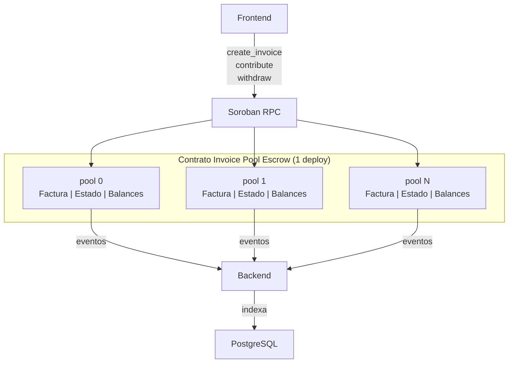

---

## Concepto: Pool de pago

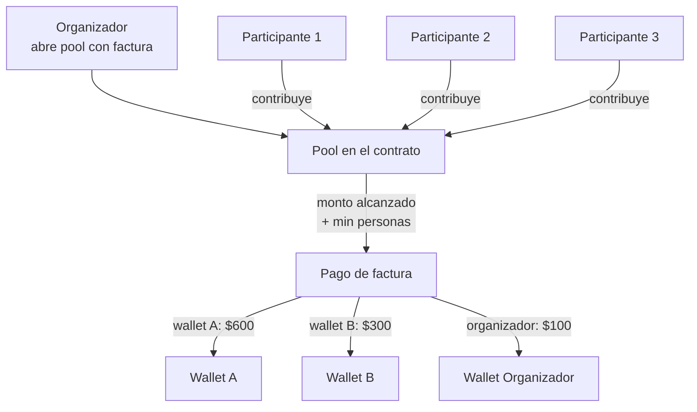

---

## Tipos de datos

### Enums

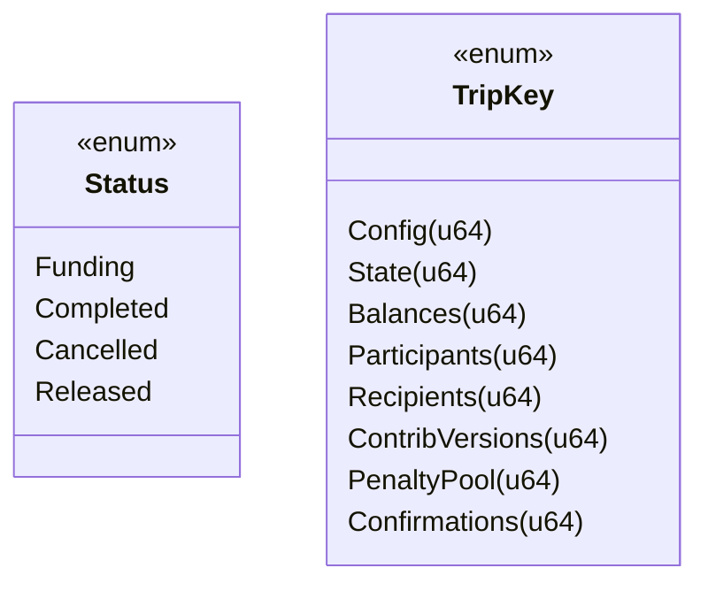

> Nota: `TripKey` y `trip_id` son nombres internos del codigo por herencia. Conceptualmente representan pools y pool_id.

### Structs

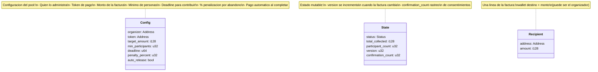

---

## Storage

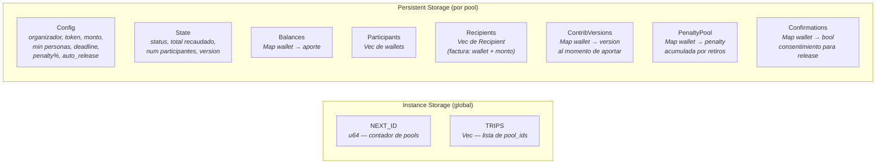

| Clave                 | Scope    | Descripcion                                                            | Limite                 |
|-----------------------|----------|------------------------------------------------------------------------|------------------------|
| `NEXT_ID`             | Global   | Contador auto-incremental de pools                                     | MAX_TRIPS = 10,000     |
| `TRIPS`               | Global   | Lista de pool_ids creados                                              | MAX_TRIPS              |
| `Config(id)`          | Por pool | Configuracion inmutable del pool (incluye auto_release)                | —                      |
| `State(id)`           | Por pool | Status, total recaudado, version                                       | —                      |
| `Balances(id)`        | Por pool | wallet → cuanto aporto                                                 | MAX_PARTICIPANTS = 200 |
| `Participants(id)`    | Por pool | Lista de wallets que aportaron                                         | MAX_PARTICIPANTS       |
| `Recipients(id)`      | Por pool | Factura: wallets destino + montos                                      | MAX_RECIPIENTS = 50    |
| `ContribVersions(id)` | Por pool | wallet → version cuando aporto                                         | MAX_PARTICIPANTS       |
| `PenaltyPool(id)`     | Por pool | wallet → penalty acumulada (devuelta en cancel, perdida en release)    | MAX_PARTICIPANTS       |
| `Confirmations(id)`   | Por pool | wallet → bool (consentimiento para release; reset al volver a Funding) | MAX_PARTICIPANTS       |

---

## Ciclo de vida de un pool

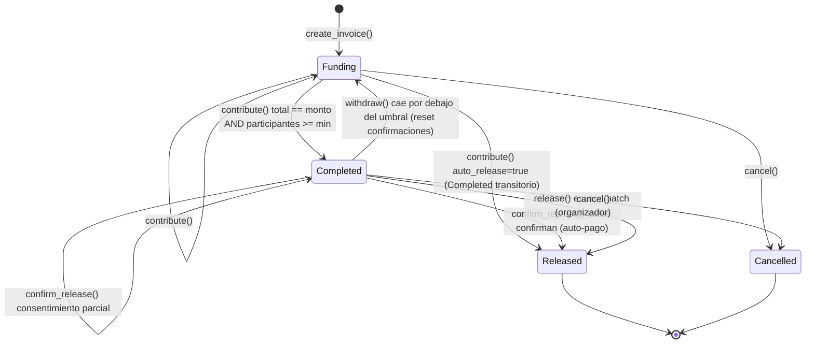

### Transiciones

| De                | A         | Trigger                                                                              | Quien        |
|-------------------|-----------|--------------------------------------------------------------------------------------|--------------|
| Funding           | Completed | `contribute()` — total == monto AND count >= min (auto_release=false)                | Participante |
| Funding           | Released  | `contribute()` — total == monto AND count >= min (auto_release=true, pago inmediato) | Participante |
| Completed         | Completed | `confirm_release()` — consentimiento parcial (aun faltan confirmaciones)             | Participante |
| Completed         | Released  | `confirm_release()` — ultimo participante confirma → pago automatico                 | Participante |
| Completed         | Funding   | `withdraw()` — total < monto OR count < min (reset confirmaciones)                   | Participante |
| Funding/Completed | Cancelled | `cancel()` — reembolso completo + devolucion de penalties                            | Organizador  |
| Funding           | Cancelled | `claim_deadline()` — deadline paso, pool en Funding                                  | Cualquiera   |
| Completed         | Released  | `release()` — escape hatch manual del organizador                                    | Organizador  |

---

## Flujos de fondos

### Contribucion al pool

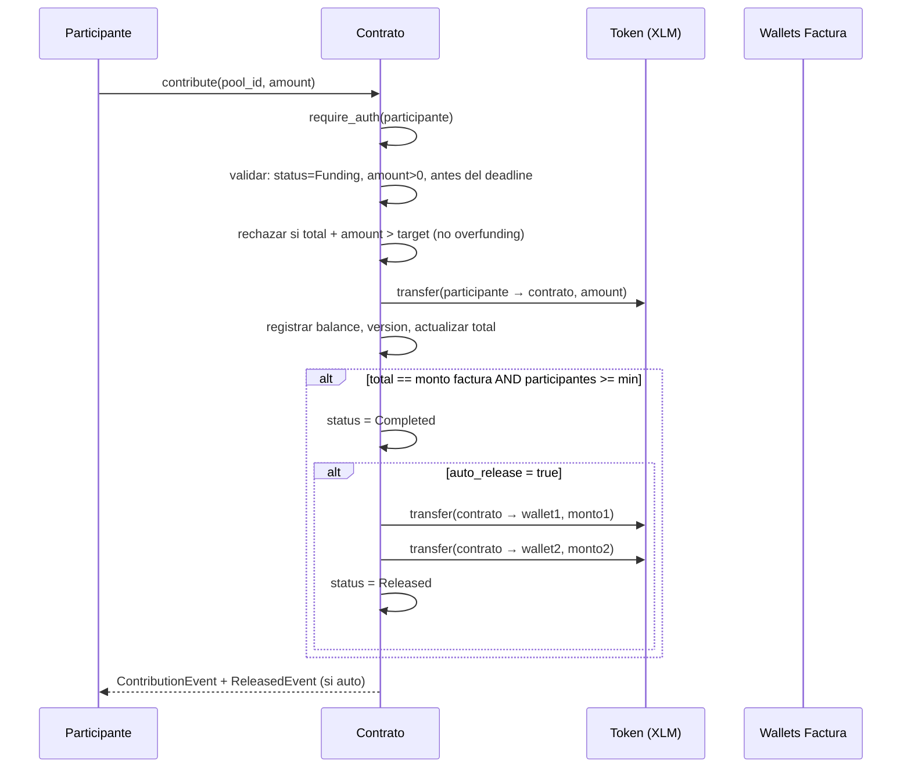

### Consentimiento y pago (confirm_release)

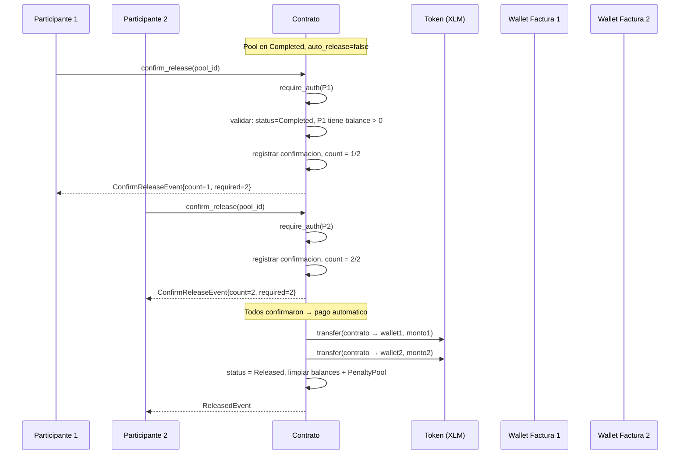

### Pago manual (release — escape hatch)

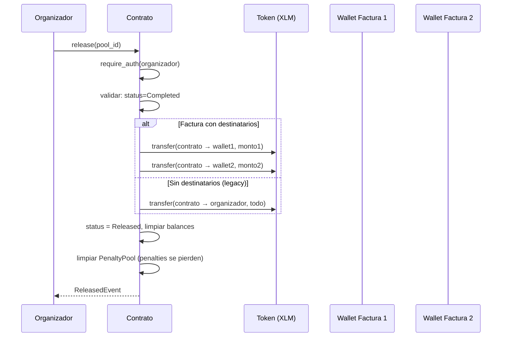

### Retiro de un participante (withdraw)

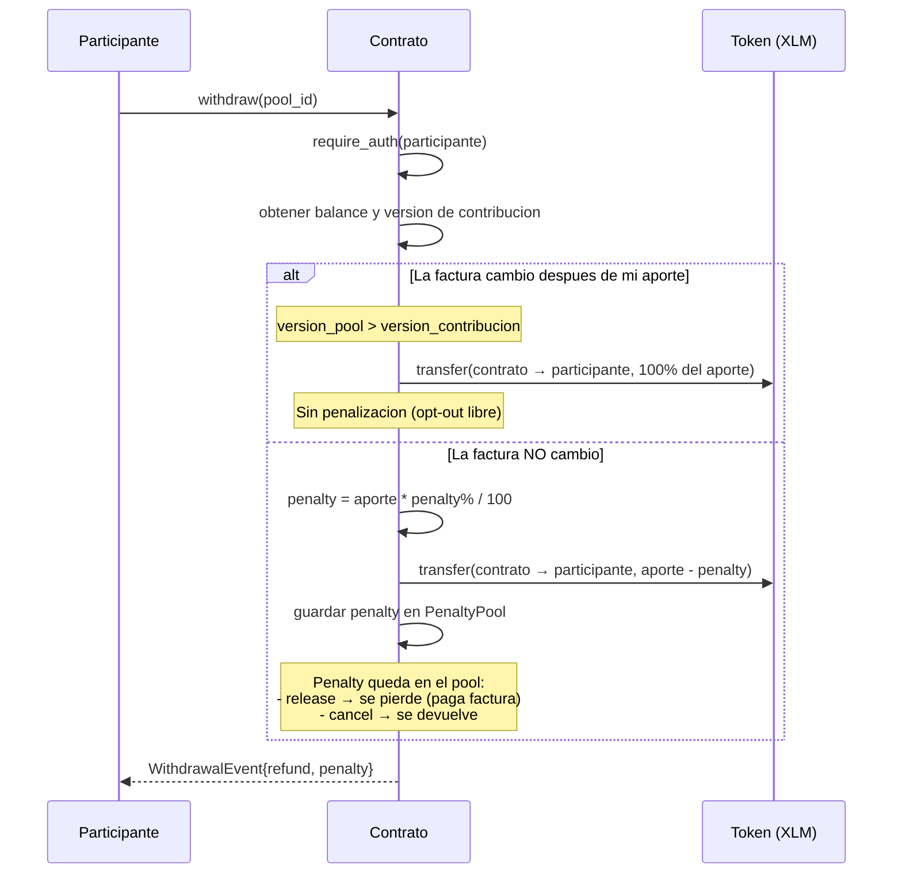

### Cancelacion (reembolso completo)

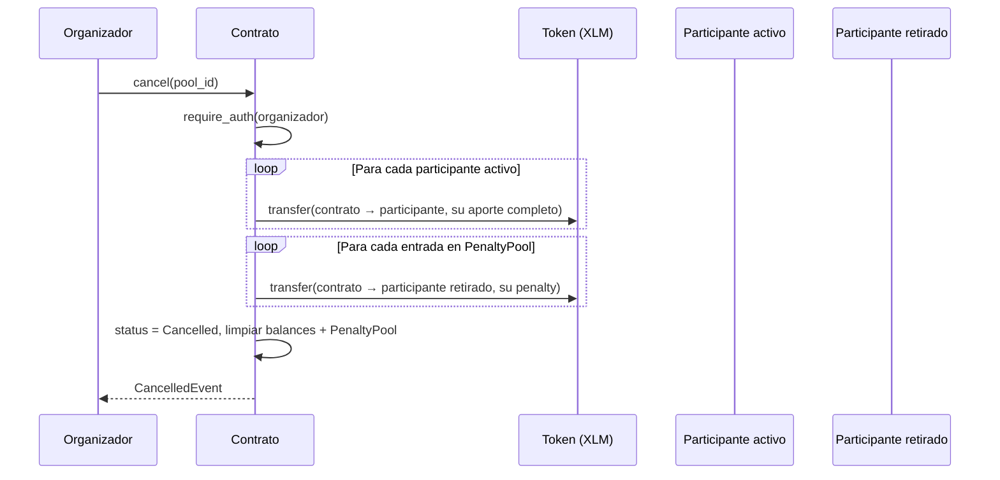

---

## Sistema de consentimiento (versionado)

La factura puede cambiar despues de que los participantes ya aportaron. El contrato garantiza que **nadie pague algo que
no acepto**:

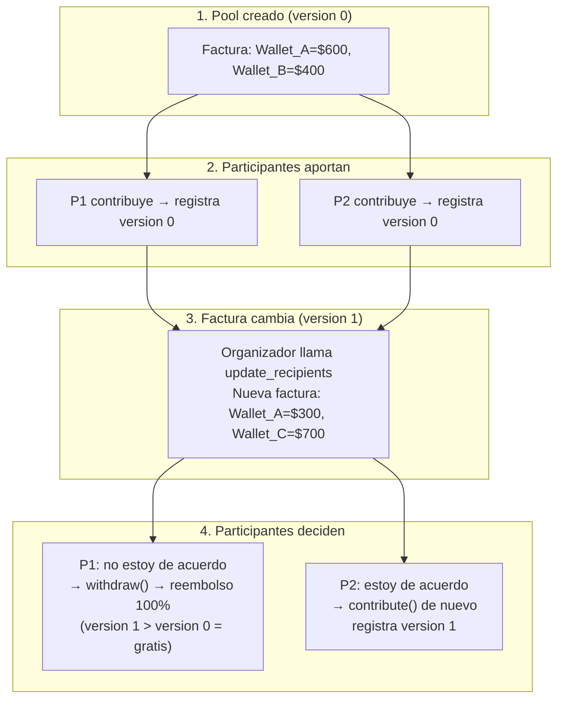

**Regla**: Si `state.version > contributed_at_version`, el participante puede retirarse **sin penalizacion**. Si
contribuye de nuevo, acepta la nueva version.

---

## Eventos

Todos emitidos via `#[contractevent]` (SDK v25 / Protocol 23):

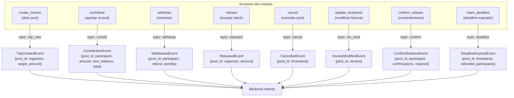

---

## Integracion con el sistema

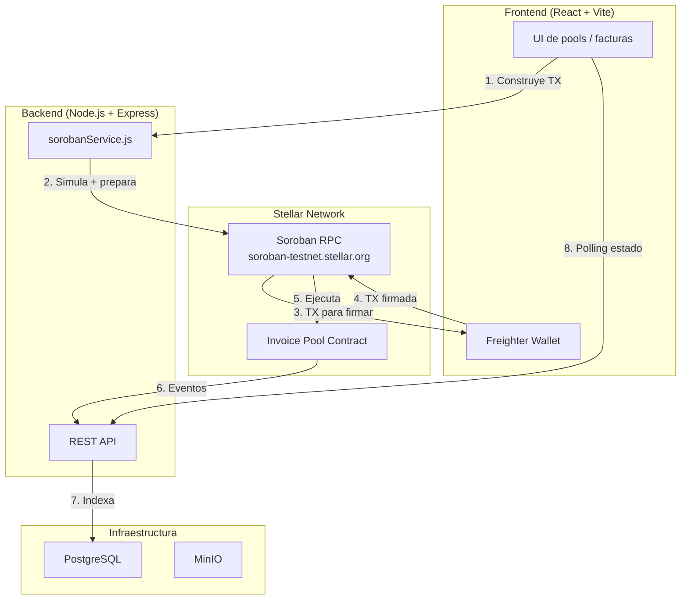

---

## Permisos

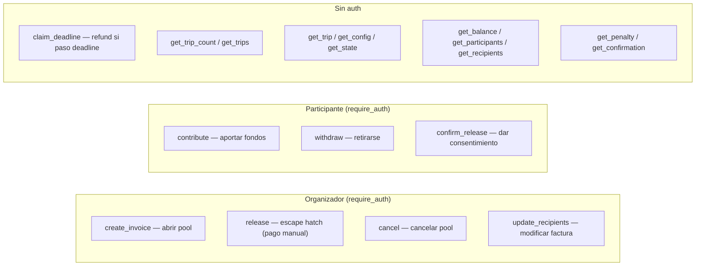

---

## Cobertura de tests

### Unitarios (23)

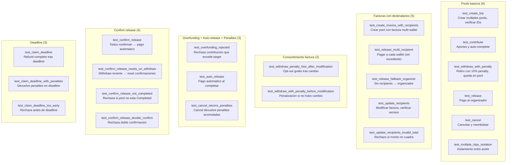

### Integracion (testnet, 64 assertions)

1. **Happy path**: crear pool → aportes → auto-complete → release (organizer escape hatch)
2. **Withdraw**: penalizacion 10%, penalty queda en PenaltyPool (no redistribuye)
3. **Cancel**: reembolso completo a participantes activos
4. **Aislamiento**: multiples pools independientes, verificacion cruzada de estados
5. **Multi-wallet + confirm_release**: create_invoice con recipients → contribuir → confirmar → auto-pago unanime
6. **Overfunding**: contribucion que excede target rechazada, estado no cambia
7. **Auto-release**: create_invoice auto_release=true → contribuir → pago inmediato sin confirm
8. **Consent**: contribute → update_recipients → withdraw sin penalty (opt-out gratis)
9. **Cancel + penalties**: withdraw con penalty → cancel → penalty devuelta al retirado
10. **Deadline**: pool en Funding → esperar deadline → claim_deadline → refund completo

---

## Decision de arquitectura: Multi-pool vs Factory

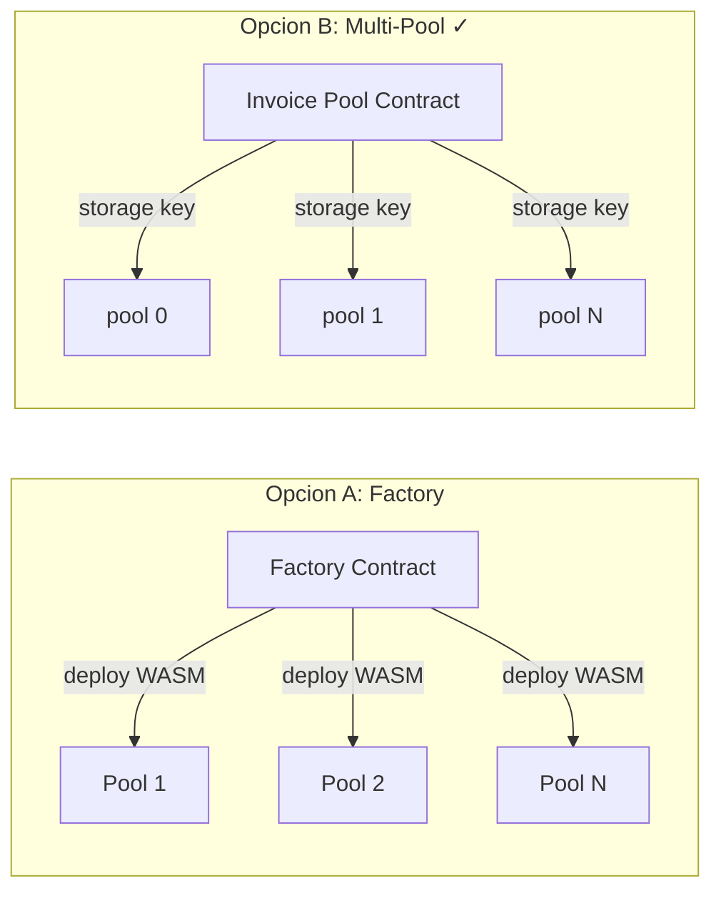

| Aspecto       | Factory                       | Multi-Pool                |
|---------------|-------------------------------|---------------------------|
| Deploy        | WASM por pool (~100k stroops) | Un solo deploy            |
| Costo         | Alto (deploy repetido)        | Bajo (solo storage)       |
| Complejidad   | Factory + tracking            | Logica simple con pool_id |
| Aislamiento   | Total (contratos separados)   | Por storage key           |
| Escalabilidad | Ilimitada pero cara           | Hasta 10,000 pools        |

**Decision**: Multi-pool. Mas simple, mas economico, suficiente para el caso de uso.

---

## Persistencia

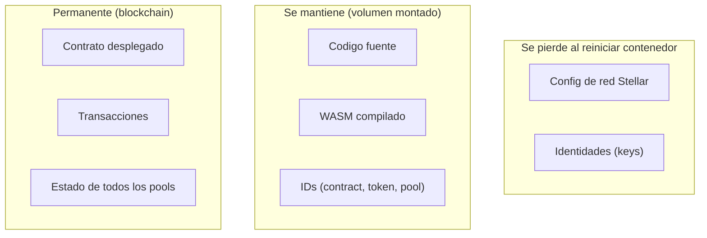

Despues de reiniciar:

```bash
make setup-network       # Reconfigurar red
make setup-identities    # Recrear identidades
make trip-count          # Verificar que el contrato responde
```
